I've always wanted more out of iOS Shortcuts, but I often find [no-code development platforms](https://en.wikipedia.org/wiki/No-code_development_platform) to be surprisingly difficult

Previous to this project, the extent of my Shortcuts experience was logging my level of comfort, location in my home, and a time stamp to an Apple Note for a home energy project. The time stamped comfort data was then layered over the actual temperature in those locations so that insights could be made (the data was more interesting than you might expect)

More recently, I wanted to post photos to a [Hugo](https://gohugo.io) blog (**Note:** this site is also a Hugo blog) directly from my iPhone. As I think about it now, I might opt to use AI to write a native iOS app from scratch just for this purpose, but at the time leveraging Shortcuts seemed like a good move

As mentioned, I never found Shortcuts to be intuitive so I enlisted the help of AI (unfortunately I don't remember which model / interface). Obviously AI was not a frequent user of Shortcuts either, so it was far from a one-shot solution. Since we iterated and learned together, I figure it might be wise to write down where we ended up. Although this was written for my specific Hugo application, the fundamentals should apply to your use case too

First, I added a *Select photos* block. I don't want to post videos so I de-selected them from *Include* and I do want to be able to include multiple photos per post, so I enabled *Select multiple*

**Note:** this sequence of processing blocks ends here. I think one of the learning curves of Shortcuts is that blocks can reference the output of any block above them, so processing chains can start and end as needed

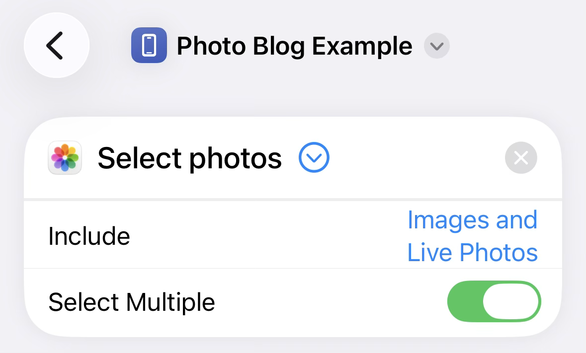

Next, I wanted to be prompted for a title, so I used *Ask for **Text** with **Title*** where **Title** is the title of the pop-up prompt, (the post) title in this case. No default title is set and multiple lines are not allowed also since it's a title (and not a body)

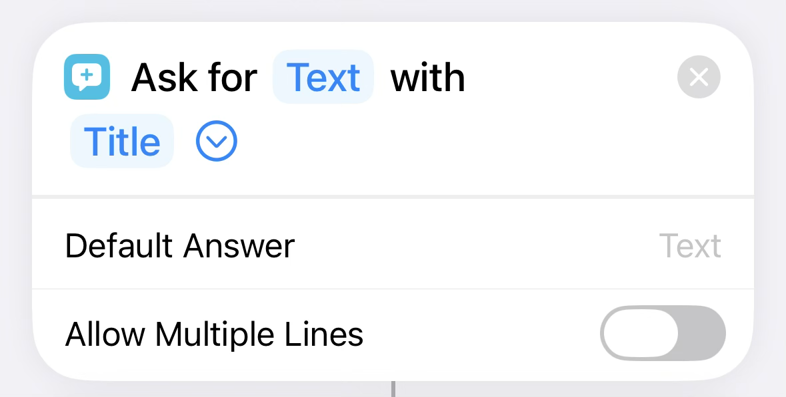

There is a series of string manipulation blocks following the *Ask for Text* block

1. *Trim whitespace from with **Ask for input*** trims whitespace and new lines from the beginning and end of the prompt input (title text in this case). This is to clean up the human readable version of the title
2. *Change **Ask for input** to lowercase* is a parallel string processing block that lowercases all of the text in the prompt input. This will be used to make a clean URL for the blog post (and photos)
3. *Replace **[^a-z0-9-]** with **<space>** in **Updated Text*** continues processing the lowercase string from step 2 and replaces anything not alphanumeric or a dash with a space
4. *Trim whitespace from **Updated Text*** trims the whitespace after the non-alphanumeric (or dash) characters are converted to spaces in step 3
5. *Replace **<space>** with **-** in **Updated Text*** replaces all the spaces in the output of step 4 with dashes to make what should be a nice, clean, URL-safe string

**Note:** the interesting thing here is the two parallel string processing chains that start at the input prompt: one for the human readable title and the other for a URL formatted title. As mentioned above, any of these outputs can be inputs to blocks below

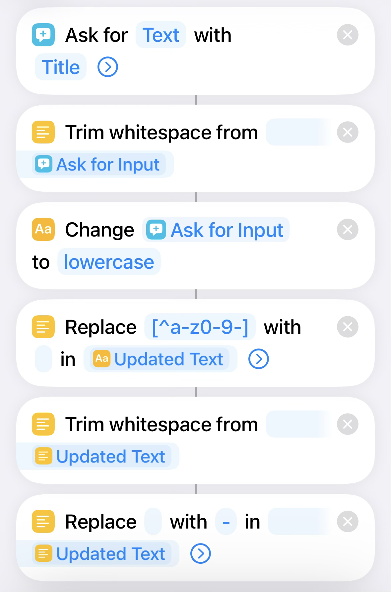

Next comes prompting for tags for the blog post

1. *Ask for **Text** with **Tags (comma-separated)*** prompts the user to type tags that are comma-separated 
2. *Change **Ask for Input** to **lowercase*** lowercases the tag input string, similar to the URL friendly title string
3. *Split **Updated String** by **Custom ,*** splits the lowercased string at each comma

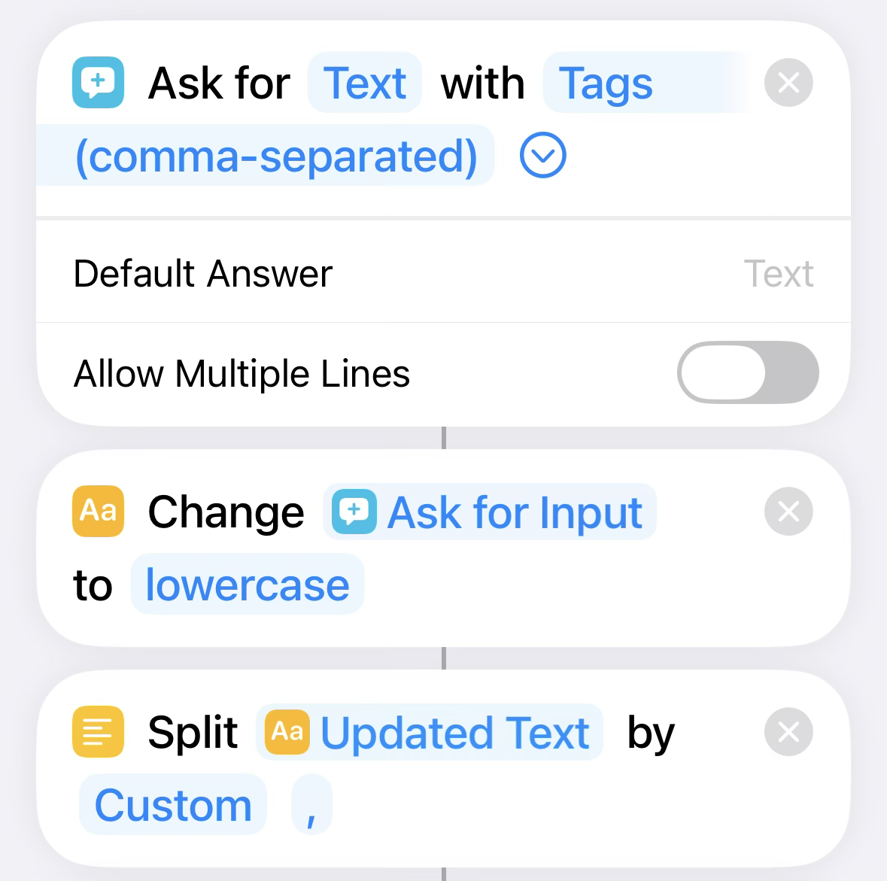

Let's up the complexity and loop over the list output by the string split 

1. *Repeat with each item in **Split Text*** iterates over the string split list
2. *Trim whitespace from **Repeat Item*** trims any leading or lagging spaces in each tag
3. *Text **”Repeat Item”*** surrounds each white space trimmed list item with double quotes
4. *End Repeat* ends the loop
5. *Combine **Repeat Results** with **Custom ,*** combines the list into a string, delimited by the custom comma character

**Note:** this section effectively surrounded each tag by double quotes as is required by the [Hugo toml front matter](https://gohugo.io/content-management/front-matter/)

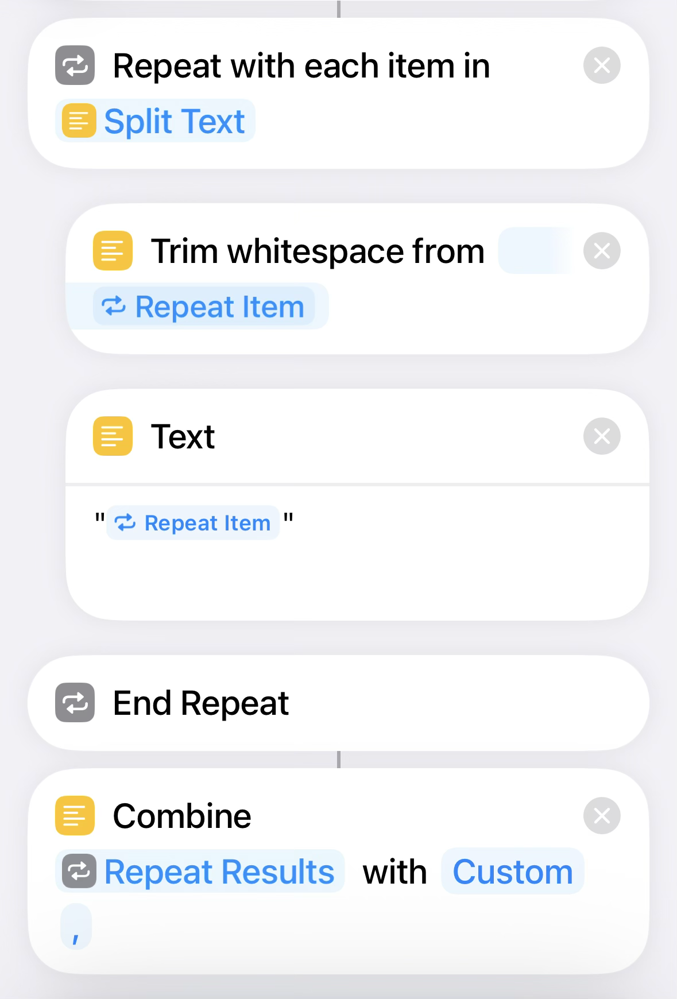

Next is an easy section

1. *Ask for **Text** with **Body*** prompts for body text. This input allows multiple lines since it's the body of the blog post 
2. *Trim whitespace from **Ask for Input*** just cleans up any whitespace from the beginning or end of the blog body

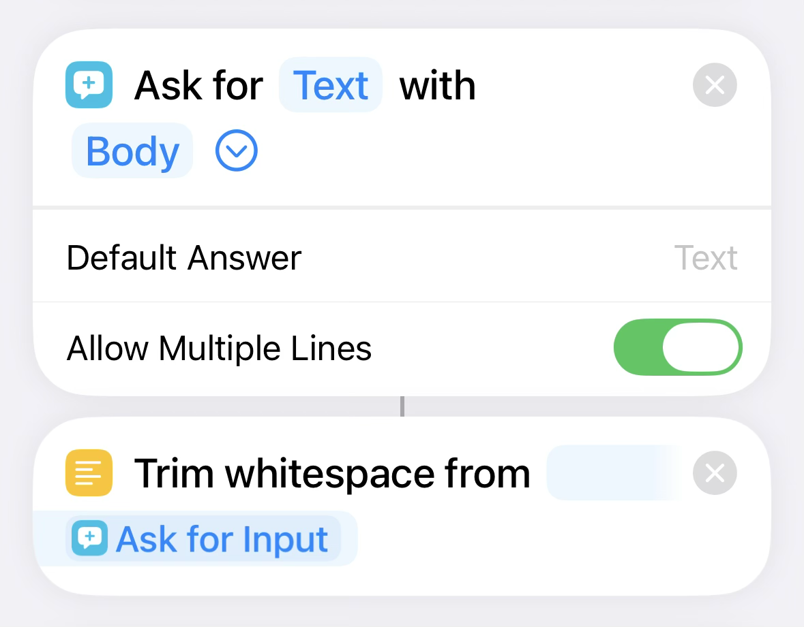

The Hugo front matter also needs date time in the format: `2024-02-02T04:14:54-08:00`

1. *Current Date* gets the … current date
2. *Format **Date*** in ISO 8601 format and enable the time
3. *Format **Date*** in Custom format `yyyyMMddHHmmss`

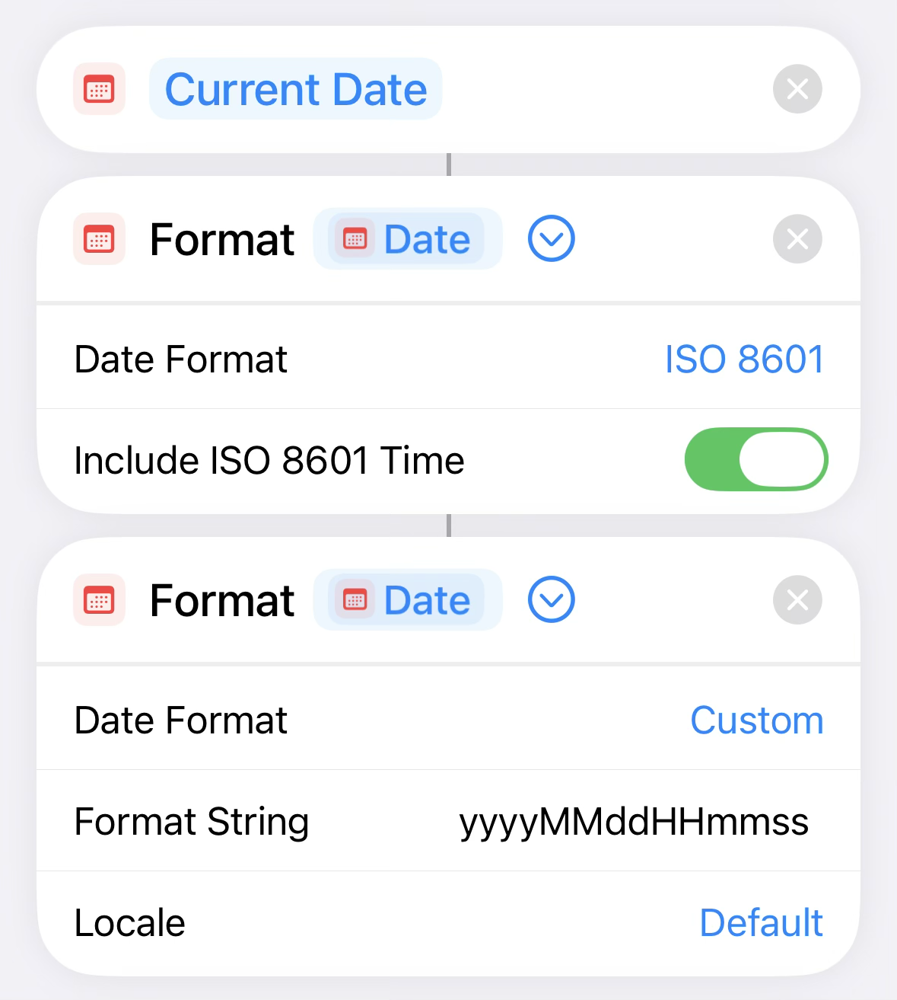

Next is processing the photos that we selected in the first step. **Note:** there will be two screen shots covered by the next numbered list

1. *Repeat with each time in **Photos*** iterates over each of the photos we selected
2. *Resize **Repeat Item** to **Longest Edge 2000*** resizes each photo to have a maximum edge of 2,000 pixels
3. *Convert **Resized Image** to **JPEG*** converts each resized image to JPEG with the shown quality setting
4. *Set name of **Converted Image** to **Updated Text**-**Formatted Date**-**Repeat Index*** sets the file name to the URL-safe title, followed by the formatted date, then the list index of the photo
5. *Save **Renamed Item** to **image*** saves the renamed item to a location of your choosing. In this case, it's the image directory of my blog in the [Working Copy](https://workingcopy.app/) app

This is the end of the loop processing the list of photos selected by the user at the beginning of the Shortcut (but you won't see the end of the loop until the next screen shot)

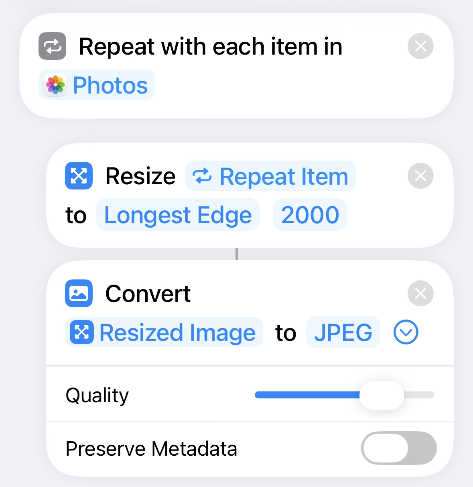
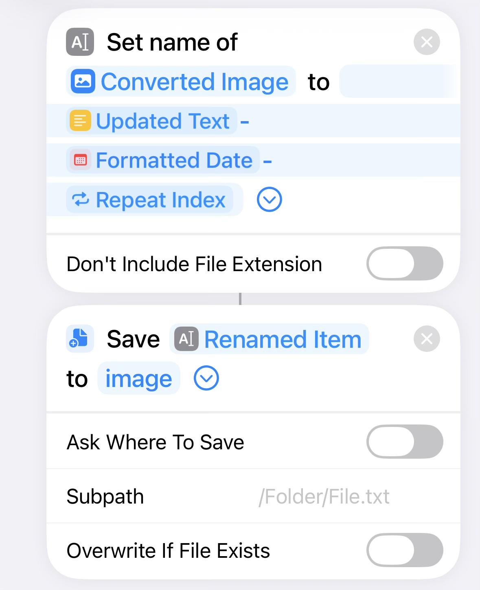

The items out of the photo processing loop are iterated over by another loop

1. *Text **”/image/<Repeat Item>.jpeg”*** generates a string for each photo
2. *Combine **Repeat Results** with **Custom ,*** concatenates all the double-quoted jpeg photo paths into a single comma delimited string

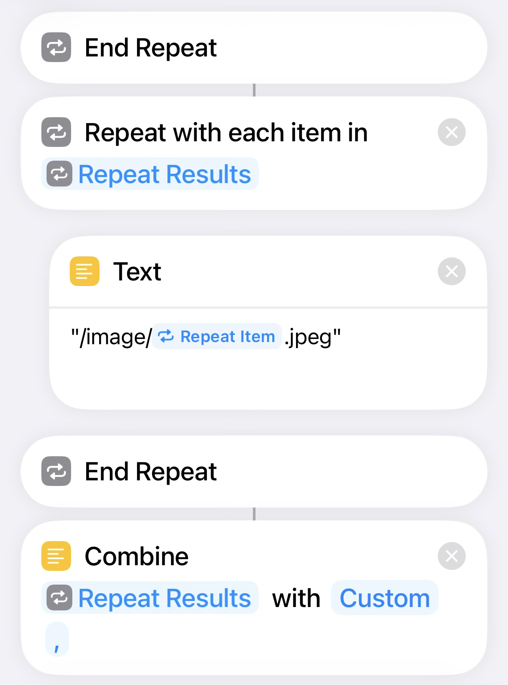

The last act will combine all the steps above to generate the actual blog post

1. *Text* let's go line by line
2. *\-\-\-* is the start of the front matter
3. *title: “**Updated Text**”* adds the title formatted for humans
4.  *date: **Formatted Date*** adds the formatted date
5. *tags: [**Combined Text**]* adds the comma delimited list of double quoted tags
6. *photos: [**Combined Text**]* adds the comma delimited list of double quoted photo paths
7. *draft: false* defaults the post to be published when pushed
8. \-\-\-
9. *Updated Text* adds the body text
10. *Save **Text** to **posts*** saves the blog post text we generated to the repo path in the Working Copy app Files directory
11. *Rename **Saved File** to **Updated Text.md*** renames the blog post save file to <the URL friendly title>.md

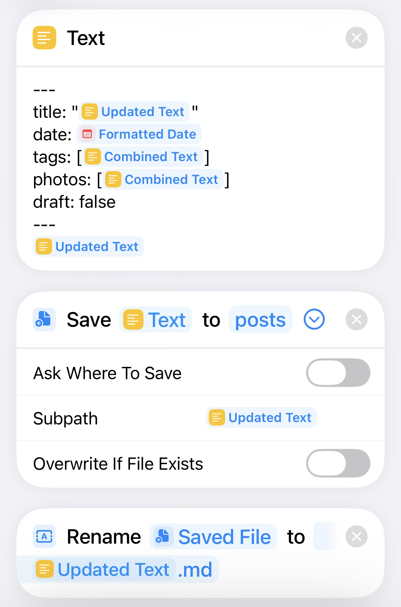

Wow, that was a lot!

Although that was a little tedious, it was worth writing it all down. In hindsight, Shortcuts are pretty powerful and logical, but I don't know if they are necessarily intuitive. It's hard to argue that this isn't a lower lift than even AI developing a markdown editor with templates and git support :)

If I were to add one thing it would be a set of thumbnail image, but my Hugo template isn't set up for them yet

