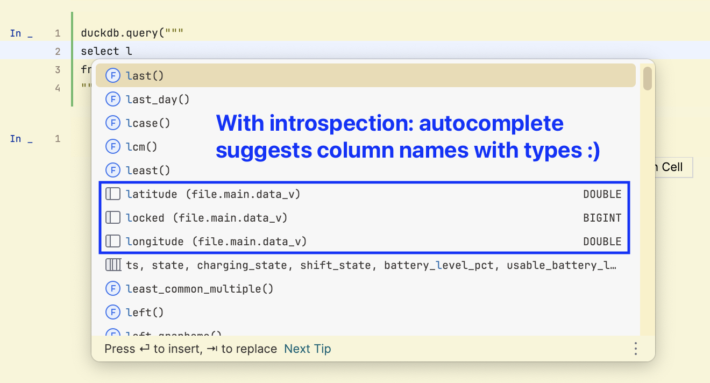

My first exposure to [DuckDB](https://duckdb.org) was doing a query on a [Parquet](https://en.wikipedia.org/wiki/Apache_Parquet) file. The performance of [predict pushdown](https://duckdb.org/2021/06/25/querying-parquet.html), where only the relevant columns are read from disk, qualified as a legitimate gamechanger for doing local data analysis

More recently, I find myself reaching for DuckDB to provide a [SQL interface](https://duckdb.org/docs/data/overview) to the mentioned Parquet files, .csv files, and even [pandas dataframes](https://pandas.pydata.org/docs/user_guide/dsintro.html). The continuity of using the same language to query a remote database like [Snowflake](https://www.snowflake.com) and locally to manipulate query results for visualization is a lovely productivity boost

However, an IDE like [PyCharm](https://www.jetbrains.com/pycharm/) can't quite flex its autocomplete muscles when querying a .csv file -- or can it?!

**Note:** you can find the [Jupyter notebook used to create this tutorial on GitHub](https://github.com/ngregorich/duckdb_in_pycharm/blob/main/duckdb_in_pycharm.ipynb)

## The problem

A simple DuckDB query in Python looks like this:

```python
duckdb.query("""
select
from 'Tesla-2024-03-10 13-34-28-2024-03-10 14-25-11.csv'
""").df()
```

At present, PyCharm is not able to pull the column names from the .csv file to aid in autocompletion or other intelligent features, so typing `l` after `select ` and looking at the auto complete list does not reveal the column names `Latitude` and `Longitude` that I was expecting:


This is a little disappointing and makes the case to use DuckDB a little bit weaker

## Let's get introspective

PyCharm has a feature called [introspection](https://www.jetbrains.com/help/pycharm/glossary-database-tools-and-sql.html#introspection) that is:

> the process of loading the metadata of the database objects (for example, object names and types of columns) and source code

Introspection is the fuel for the autocomplete and other intelligent features. But how can we get PyCharm to run introspection on the .csv file that we are using in DuckDB?

This solution is a little bit of a hack, but it does the trick:

1. Create a DuckDB database on disk
   1. We often default to using DuckDB in *in-memory* mode where nothing is persisted to disk
2. Create a database `VIEW` that points to the .csv file
   1. As a reminder, a [view](https://en.wikipedia.org/wiki/View_(SQL)) takes very little space to store
3. **Bonus:** we can define new column names when defining the `VIEW`, allowing us to change to names that are a little SQL friendlier!

### Step by step

#### Prerequisites

Before we get started:

1. We'll need to [create a new Python project in PyCharm](https://www.jetbrains.com/help/pycharm/creating-and-running-your-first-python-project.html)
2. We'll also need to install `duckdb` and `pandas`:

`pip install duckdb pandas`

#### The Python side of things

We'll need to do some configuration and create the DuckDB database before we can run introspection:

1. Import duckdb

`import duckdb`

2. Configure the csv filename, the filename of the database we'll create, and the name of the `VIEW` that we'll create

```python
# raw .csv filename
csv_filename = "Tesla-2024-03-10 13-34-28-2024-03-10 14-25-11.csv"
# duckdb filename (to create)
db_filename = "file.db"
# name of view (to create)
data_view_name = "data_v"
```

3. Write SQL query that creates a `VIEW`, optionally renaming all the columns
   1. **Note:** the first and last lines of the query are the most important, containing *f-string variables* that we defined above

```python
# query to create a view that aliases each column name in the .csv to
# something more SQL query friendly
create_data_view_query = f"""create or replace view data_v as
                 select "Timestamp (PDT)" as ts,
                 "State" as state,
                 "Charging State" as charging_state,
                 "Shift State" as shift_state,
                 "Battery Level (%)" as battery_level_pct,
                 "Usable Battery Level (%)" as usable_battery_level_pct,
                 "Battery Range (mi)" as battery_range_mi,
                 "Est. Battery Range (mi)" as estimated_battery_range_mi,
                 "Ideal Battery Range (mi)" as ideal_battery_range_mi,
                 "Latitude" as latitude,
                 "Longitude" as longitude,
                 "Elevation (m)" as elevation_m,
                 "Speed (mph)" as speed_mph,
                 "Power (kW)" as power_kw,
                 "Odometer (mi)" as odometer_mi,
                 "Charge Rate (mph)" as charge_rate_mph,
                 "Current (A)" as current_a,
                 "Charger Power (kW)" as charger_power_kw,
                 "Charger Voltage (V)" as charger_voltage_v,
                 "Charger Phases" as charger_phases,
                 "Energy Added (kWh)" as energy_added_kwh,
                 "Rated Range Added (mi)" as rated_range_added_mi,
                 "Ideal Range Added (mi)" as ideal_range_added_mi,
                 "Climate" as climate,
                 "Battery Heater" as battery_heater,
                 "Inside Temp (°F)" as inside_temperature_f,
                 "Outside Temp (°F)" as outside_temperature_f,
                 "Locked" as locked,
                 "Sentry Mode" as sentry_mode
                 from '{csv_filename}'"""
```

4. Create a function to check if the `VIEW` already exists
   1. In general, we want to avoid opening the database in *read / write mode* (more on that later), so we'll only create the `VIEW` if it doesn't exist already

```python
def check_view_exists(duck_conn: duckdb.DuckDBPyConnection, check_view_name: str) -> bool:
    """Return True if check_view_name exists in duck_conn or False if not"""
    try:
        # use DuckDB Python API, not SQL query
        duck_conn.view(check_view_name)
    except Exception as local_e:
        if f"Table with name {check_view_name} does not exist" in str(local_e):
            return False
    return True
```

5. Create a function to create the `VIEW` from the query we wrote above

```python
def create_view(duck_conn: duckdb.DuckDBPyConnection, duck_filename: str, new_view_query: str) -> duckdb.DuckDBPyConnection:
    """Open database connection to duck_filename in read / write mode,
    run the new_view_query SQL query,
    re-open the database connection in read only mode,
    and return the read only DuckDB connection"""

    duck_conn.close()

    duck_conn = duckdb.connect(duck_filename, read_only=False)
    duck_conn.query(new_view_query)
    duck_conn.close()

    duck_conn = duckdb.connect(duck_filename, read_only=True)

    return duck_conn
```

6. Connect to the database if it exists, create it if not

```python
# connect to db in read mode
# if db does not exist, create it in write mode and reconnect in read mode

# close connection if it exists
if "conn" in globals():
    # noinspection PyUnresolvedReferences
    conn.close()
try:
    conn = duckdb.connect(db_filename, read_only=True)

except Exception as e:
    if "database does not exist" in str(e):
        conn = duckdb.connect(db_filename, read_only=False)
        conn.close()
        conn = duckdb.connect(db_filename, read_only=True)
    else:
        raise e
```

7. Check if the `VIEW` exists, create it if not

```python
# see if our view already exists in the db, if view does not exist, create it

view_exists = check_view_exists(conn, data_view_name)

if not view_exists:
    conn = create_view(conn, db_filename, create_data_view_query)
```

8. Confirm the `VIEW` exists, assert if not

```python
# confirm that view exists, if not assert because something went wrong
view_exists = check_view_exists(conn, data_view_name)

assert view_exists, "Error: view not created"
```

9. Ensure that the Jupyter notebook is no longer connected to the DuckDB database. The easiest way to do this is to restart the Jupyter kernel

#### Charming PyCharm

Now we need to configure this DuckDB database as a Data Source in PyCharm. Here's the [PyCharm documentation](https://www.jetbrains.com/help/pycharm/databases.html) for the Database tool and here's a step by step for doing configuring it to target DuckDB:

1. Click the *Database* icon on the right
2. Click the *+* icon in the Database menu
3. Click *Data Source*
4. Scroll to the bottom and select *Other*
5. Select *DuckDB*


                                      
6. Set *File* to the value of the `db_filename` variable in Python (`file.db` in our case)
7. Set *Authentication* to *No auth*
8. Click *Test Connection*
    1. You may be prompted to install database drivers for DuckDB
9. Click on the *Schemas* tab


10. Open the `file` expander
11. Check the box for `main` under `file`
12. Click the *Advanced* tab


13. Add a setting with *Name* `duckdb.read_only`
    1. **Note:** this and the following step are **CRITICAL**
14. Set the *Value* to `true`
15. Click *OK*


16. We can now see introspection of the .csv file in the Database window!
17. The *Deactivate* button disconnects PyCharm from the database 
    1. **Note:** Any time you connect to `db_filename` in read / write mode in Python, you will need to click *Deactivate*
    2. Similarly, to disconnect from the database in Python, use the method: `conn.close()`
18. The *Refresh* button connects PyCharm to the database


#### DuckDB concurrency

Concurrency in DuckDB can be either:

1. Multiple *read only* connections to a database
2. A **single** *read / write* connection to a database
    1. A *read only* connection cannot be made when there is an active *read / write* connection

## Results

We can now use PyCharm's syntax highlighting and autocompletion features when we query DuckDB. Here's a template to start with:

```python
conn = duckdb.connect(db_filename, read_only=True)
conn.query(f"""
select 
from data_v -- data_v cannot be replaced with a Python variable
""").df()
```

Here's what it looks like in action where I've just typed `l` and now the autocomplete engine shows us `latitude` and `longitude` like I was hoping for. Joy!



**Note:** as a reminder, you can find the [Jupyter notebook used to create this tutorial on GitHub](https://github.com/ngregorich/duckdb_in_pycharm/blob/main/duckdb_in_pycharm.ipynb)

### Next steps

If I were to dig a little deeper on this subject, I may write a Python class as a DuckDB wrapper to make things a little more object-oriented

