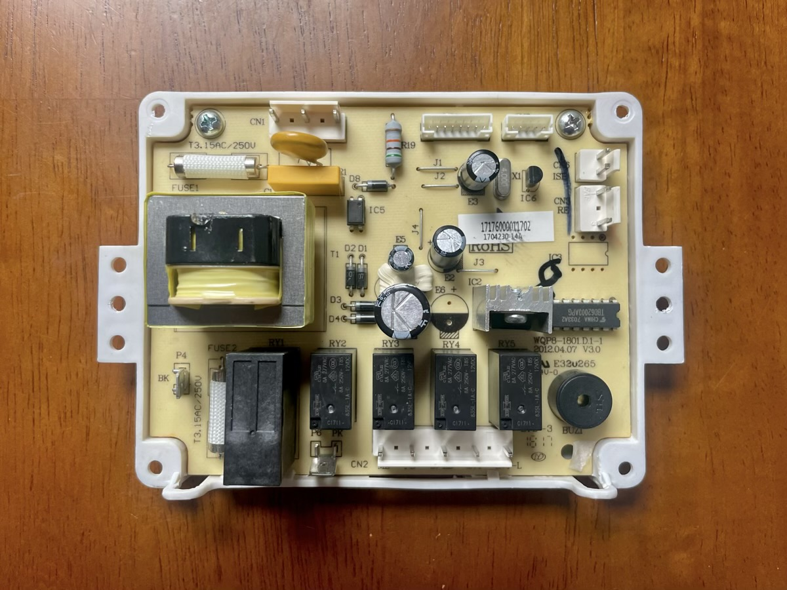
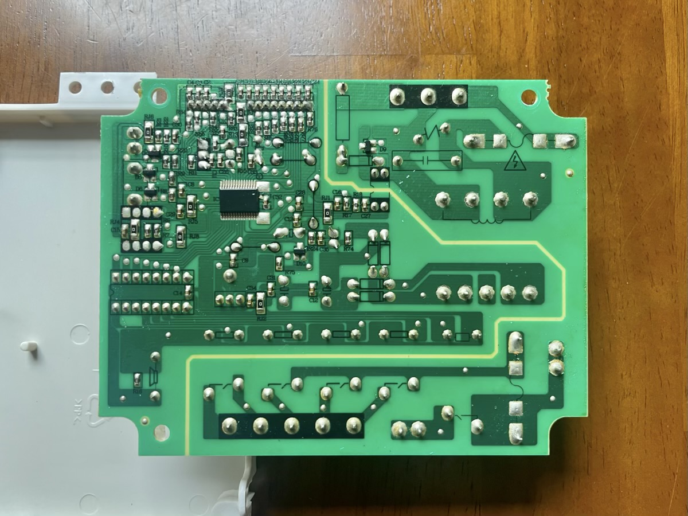
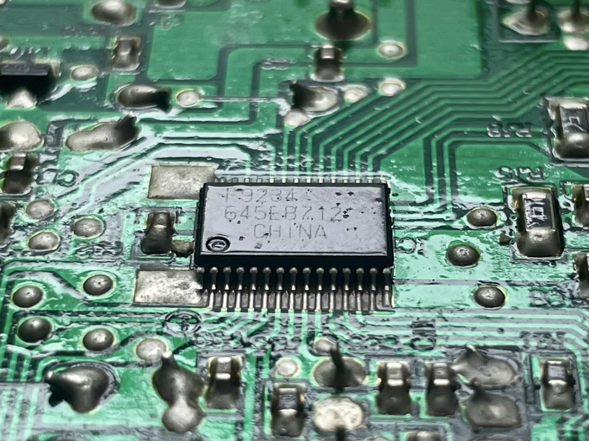
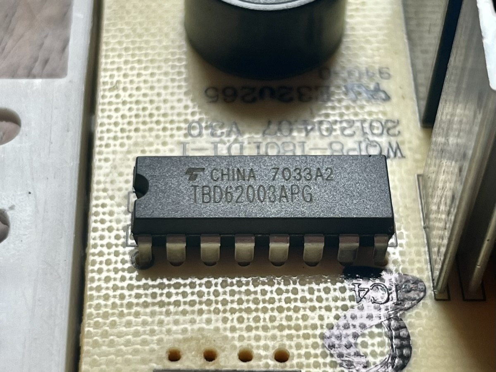
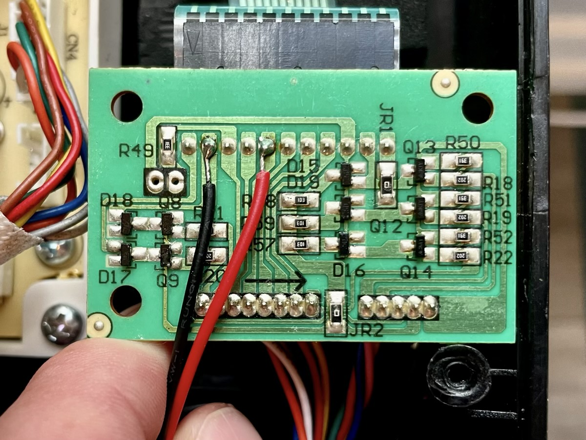
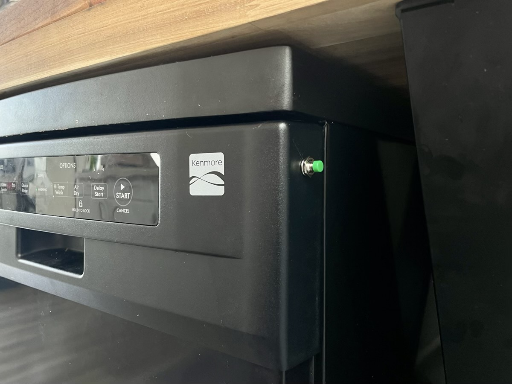

--- 
title: "Get this dishwasher started"
date: 2024-04-27T10:12:40-07:00
description: ""
categories: []
tags: ["ee", "diy", "fixit"]
toc: true
math: false
draft: false
---

## Background

It’s interesting that I’m writing my second appliance repair post in just a couple months, and I thought that was worth some reflection

I’ve been taking things apart since I was old enough to hold a screw driver. Alarm clocks, radios, computers, toys. It took over a decade to want to put them back together (to my parents’ dismay), not to mention having the skills to do so. I suppose that’s why I ended up with a couple of engineering degrees and still love it after almost 20 years

There’s also the gratification of fixing something, which has many facets. As mentioned, it certainly appeals to the nerd in me. It appeals to my wallet too. Fixing things can cost just a fraction of buying something new (assuming your time is worthless)

Fixing things should also generally have a lower carbon impact, although you need to consider whether the efficiency increases mean replacing can actually have a lower impact in the medium to long term

## The problem

**Note:** Safety first. I do not recommend trying this at home. There is live 120 VAC inside of this appliance that can kill you. Use caution! 

The dishwasher just stopped running. Like at all. The start button went sort of intermittent, then it just died

The dishwasher is a [Kenmore 58714659201B](https://www.appliancepartspros.com/parts-for-kenmore-58714659201b.html). It’s around 3/4 the size of a typical dishwasher, but it’s fully enclosed and portable on casters which is perfect in a strange little San Francisco home

I read the manual, tried the reset procedure, and nothing. I opened it up and looked for shorts and opens and scorch marks and still nothing. All of the other buttons worked fine, but not the start button. Bummer

The buttons are [membrane switches](https://en.wikipedia.org/wiki/Membrane_switch) which is a sandwich of thin plastics, conductive inks, and adhesives with a graphic overlay. They are fairly common in kitchen appliances so you’ve certainly seen one. They are low cost and make adding a dozen buttons and LEDs to a device as quick as peeling a backing off, sticking the membrane on, and plugging a single connector into another board

As I have found, membrane buttons can wear out with usage. Unfortunately, a replacement membrane assembly is no longer available for this dishwasher

Lucky for us, a membrane button is often just a normally-open switch, so if you know *where* the membrane switch shorts across, you can add a new switch in its place. Without a schematic, that’s easier said than done

## The insides

I didn’t actually need to do anything to the main board itself (**Edit:** until I ripped some traces putting too much stress on the connectors while reassembling), but I thought I’d take some nice pictures while in there

The top:

The bottom:

There are only 2 [integrated circuits](https://en.wikipedia.org/wiki/Integrated_circuit) in the whole design:

An [NEC / Renesas PD78F9234](https://rocelec.widen.net/view/pdf/zp0meveg5f/RNCCS06728-1.pdf) or similar microcontroller

and a [Toshiba TBD62003APG](https://toshiba.semicon-storage.com/info/TBD62003AFG_datasheet_en_20150724.pdf) DMOS transistor array, which looks like an array of 7 high power N-FET common source amplifiers 

## The debug

The membrane assembly connects to a small PCBA with some [SOT-23](https://en.wikipedia.org/wiki/Small-outline_transistor) and passive components as well as a couple wiring harnesses to the main board. I was on the hunt for the pins connected to the failed membrane start button so I could put my own switch in its place

I originally broke out the [Saleae logic analyzer](https://www.saleae.com) to connect to all the membrane pins, push all the buttons, and use the process of elimination to find the pins connected to the start button. It was not fruitful

Without a schematic and with the high likelihood of the membrane using a [matrix circuit](https://en.wikipedia.org/wiki/Keyboard_matrix_circuit) (not to mention the pressure of not having a working dishwasher), I eventually decided to methodically short pins on the membrane connector until I found the start button

I was in luck:

I soldered a panel mount momentary switch to the pins shown, powered the dishwasher back on, closed my eyes, and pushed the button

**Click, buzz, whir!** We got this dishwasher started!

I drilled a hole, mounted the switch, and put it back together

When thinking about where to mount the button, it occurred to me that membrane switches are probably pretty resistant to accidentally presses. For that reason, I mounted my button on the side where it seemed less likely to get bumped

I have to admit, I kind of like the little green button :)
