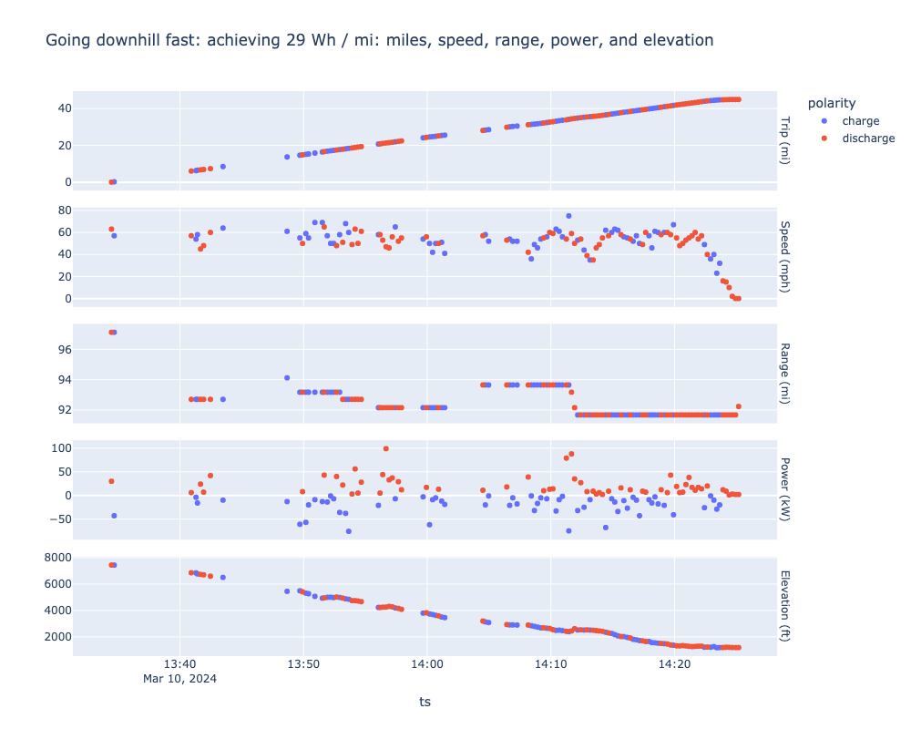

I recently drove my Tesla Model Y from San Francisco to Lake Tahoe and back. The efficiency driving down from the mountains surprised me so much that I did [a full analysis on the data](https://github.com/ngregorich/kirkwood_to_jackson/blob/main/kirkwood_to_jackson.ipynb)

The [Jupyter notebook has the full write-up](https://github.com/ngregorich/kirkwood_to_jackson/blob/main/kirkwood_to_jackson.ipynb), here is the result:

