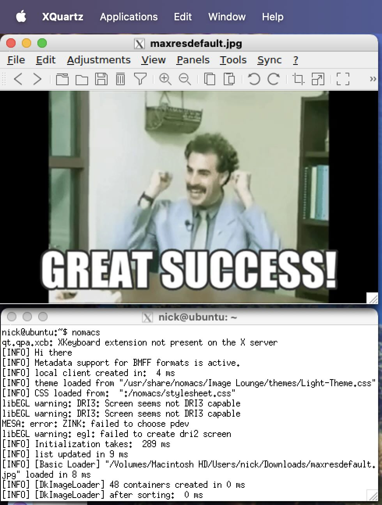

# Background

[OrbStack](https://orbstack.dev) is a great way to run Linux (Docker) containers and (virtual) machines on macOS. Alternatives include the obvious [Docker Desktop](https://www.docker.com) and another great macOS tool: [UTM](https://mac.getutm.app). The folks at OrbStack have done us a solid and made a [comparison chart of OrbStack vs UTM](https://docs.orbstack.dev/compare/utm)

There is something particularly relevant to this post at the very bottom: `Run graphical apps: OrbStack: ❌ UTM: ✅`

Granted, so many Linux use cases are command line only, but it's still a little bit of a drag. As you can see from the rest of the comparison, there are many features that make OrbStack a compelling solution — why don't we see if we can get the GUI GUIing?

# Solution(s)

The OrbStack [Machines documentation](https://docs.orbstack.dev/machines/) has some suggestions on how to run graphical applications:

> Graphical apps
> 
> OrbStack does not currently support running graphical Linux apps by default, but you can set up XQuartz and use it as an X11 server in Linux. Xrdp is another option.

There are a couple of other options: [VNC](https://en.wikipedia.org/wiki/VNC) (which can be laggy) and [NoMachine NX](https://www.nomachine.com) (which is proprietary but when I used it years ago, very performant)

## XQuartz as an X11 server

This wasn't the first method I tried, but it was the first that I was successful with. I stumbled upon a GitHub issue: [X11 forwarding support in builtin SSH server](https://github.com/orbstack/orbstack/issues/139) that contains a lot of useful tips that inspired me to write this post

The XQuartz pro-tips come from SalvatoreT, thuvasooriya, and weakish starting with [this post](https://github.com/orbstack/orbstack/issues/139#issuecomment-1595364746)

I'm going to write down what worked for me

1. Install brew: follow the instructions on: [brew.sh](https://brew.sh)
   1. Probably optional, but really?? (MacPorts folks are cool though)
2. Install OrbStack (duh)
   1. `brew install orbstack`
   2. or download it from: [orbstack.dev](https://orbstack.dev/download)
3. Install XQuartz
   1. `brew install --cask xquartz`
   2. or download it from: [xquartz.org](https://www.xquartz.org)
4. There are conflicting reports on whether you need to log out and log in or source your shell (`source zshrc` or similar) or simply start a new terminal after installing XQuartz in order to `set DISPLAY`. I don't remember what I did, so just keep this in your back pocket
5. Create an Ubuntu machine in OrbStack
   1. `orb create ubuntu <optional machine name>`
   2. or in the OrbStack app click Linux: Machines on the Toolbar on the left, then click + New Machine on the upper right (the defaults should be OK)
6. If you don't have one already, create an ssh key pair on your Mac
   1. Choose a site you trust for instructions, [here's GitHub's](https://docs.github.com/en/authentication/connecting-to-github-with-ssh/generating-a-new-ssh-key-and-adding-it-to-the-ssh-agent#generating-a-new-ssh-key)
7. Connect to the machine via ssh
   1. `ssh orb`
      1. **Note:** `ssh orb` connects to the default machine. Use `orb default` to see the default and `orb default <machine name>` to set it
      2. Alternatively, you can connect to a custom-named machine with: `ssh <custom name>@orb` or with mDNS: `ssh <custom name>.orb.local`
8. We need to add your macOS SSH key to `~/.ssh/authorized_keys`
   1. In every Orb machine I've created, `~/.ssh` already contains my macOS `id_rsa` and `id_rsa.pub` key pair, so there is no need to copy it to the machine as instructed on the GitHub issue. Your mileage my vary, particularly if you don't have an `id_rsa` key pair
      1. If you do need to copy your public key over, on your macOS terminal: `ssh-copy-id orb`
   2. To add the public key to the list of authorized keys on the Orb machine: `cat ~/.ssh/id_rsa.pub > ~/.ssh/authorized_keys`
      1. Again, `id_rsa.pub` may need to be something like `id_ed25519.pub`
9. To avoid a warning upon login, we need to create a `.Xauthority` file on the Orb machine: `touch ~/.Xauthority`
   1. This is optional, the .Xauthority file will be created after the warning
10. Install openssh-server on the machine
    1. `sudo apt install openssh-server -y`
11. Change the openssh-server port to 2222
    1. A robust solution
       1. Create the directory: `sudo mkdir -p /etc/systemd/system/ssh.socket.d/`
       2. Run the following commands to create the file and add the custom port
   ```bash
   echo "[Socket]
   ListenStream=
   ListenStream=2222" | sudo tee /etc/systemd/system/ssh.socket.d/listen.conf
   ```
   2. **Note:** an alternative quick and dirty solution that will be over-written when openssh-server is updated
      1. `sudo sed -i 's/\b22\b/2222/g' /lib/systemd/system/ssh.socket`
12. Reload the configuration we just added: `sudo systemctl daemon-reload`
13. Restart the ssh server `sudo systemctl restart ssh.socket`
14. On macOS, open XQuartz (_command + space_, then type `xquartz`)
15. Open a new Terminal (_command + N_)
    1. You might need to run bash to see intelligible characters if you have a fancy zsh setup using Unicode and fun fonts
16. Connect to the ssh server running on port 2222 of our Orb machine with X forwarding: `ssh -X -p 2222 <custom name>.orb.local`
    1. You might be able to substitute `127.0.0.1` for `<custom name>.orb.local` if you only have a single Orb machine running that uses port 2222
    2. You **cannot** use hostnames including `orb` or `<custom name>.orb`
       1. This will result in the error: `X11 forwarding request failed on channel 0` upon login and a failure to launch X applications
17. At this point you should be able to launch GUI applications on your Orb machine
    1. I've installed the image preview application nomacs with `apt install nomacs`
    2. You then launch it with `nomacs`



Maybe another time I'll revisit some of the other methods to use a GUI with an Orb Stack machine
