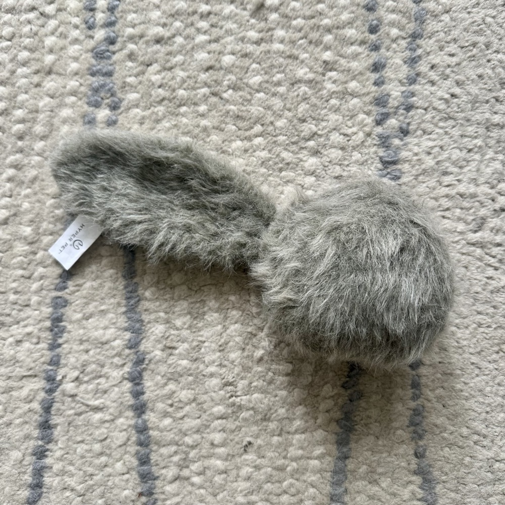
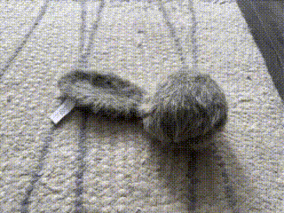
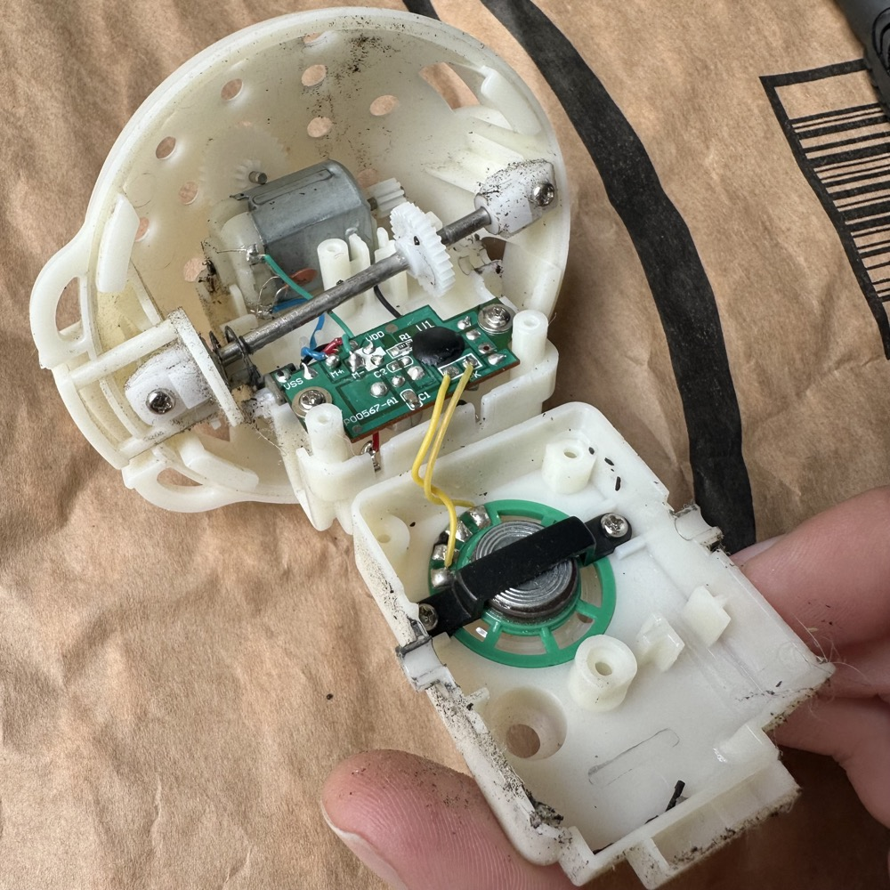
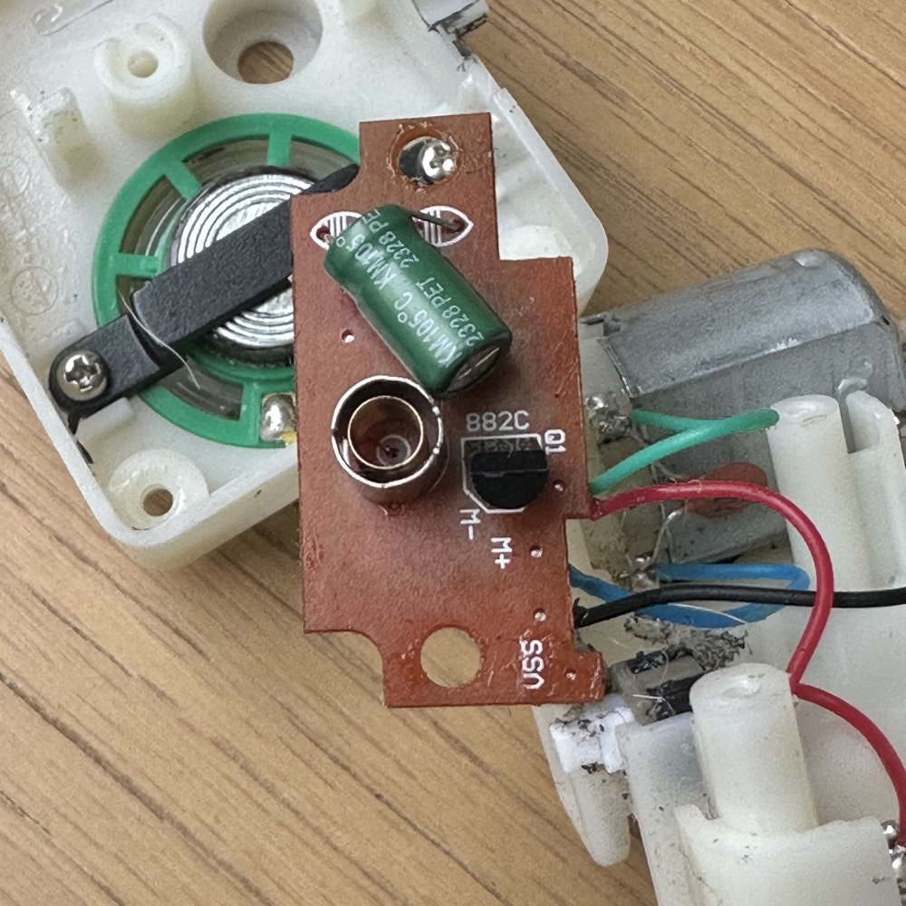
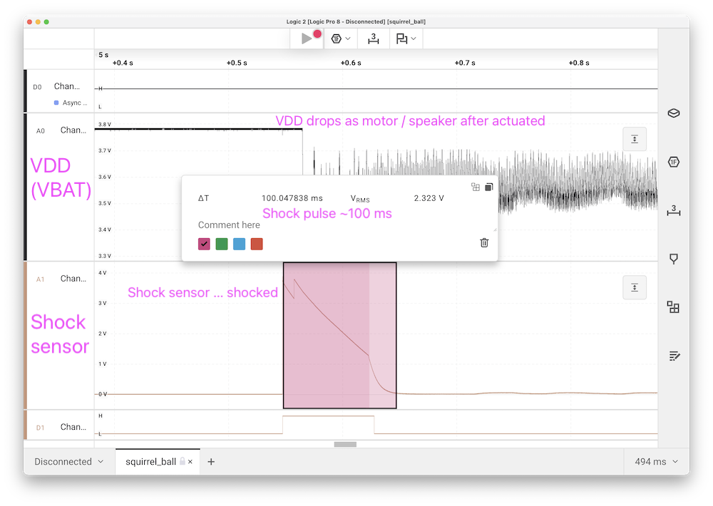
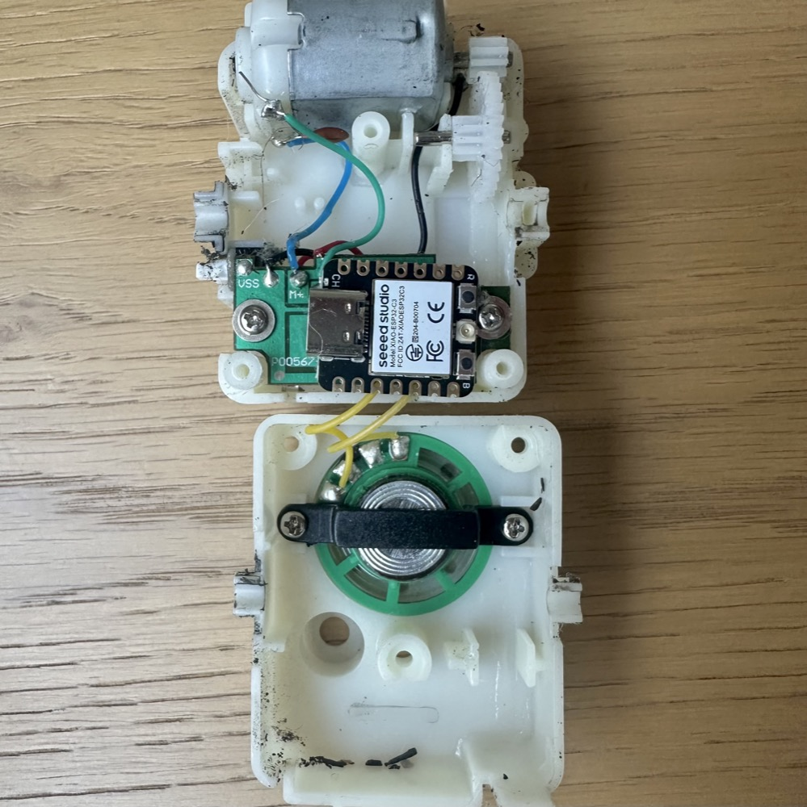
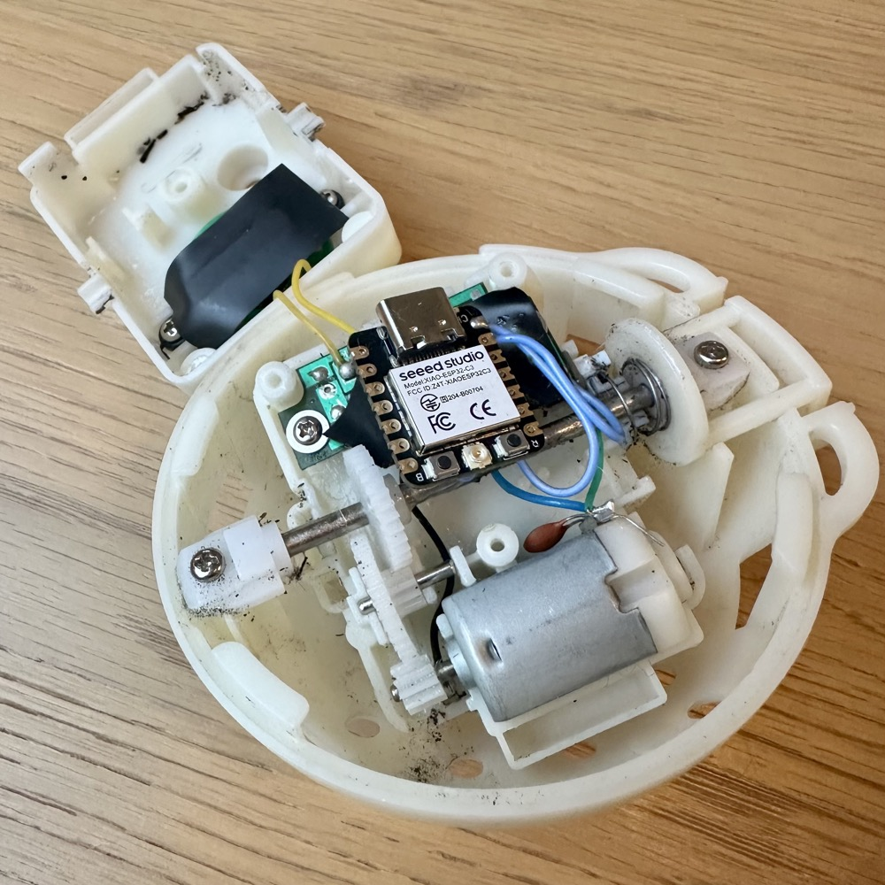

I'm going to start with some introspection

It's been a while since I've written a post and I have to admit I miss it. I have had some (happy) things going on in my life, but I should have more time for bloggin' now :)

I have actually been working on some projects: a bigger system integration project with some 3D design in [FreeCAD](https://www.freecad.org) and a couple smaller microcontroller projects

I've found the small microcontroller projects to be super rewarding. In a single evening with a couple dozen lines of code I can build something that might not exist anywhere in the world that solves an actual problem in my life

That's pretty exciting and highlights that a project doesn't have to be big and expensive to be high value. The return on investment in those twenty lines of code is incredible!

# The problem

A couple years ago, we adopted a Great Pyrenees mix named Roo. We love her deeply and I think the feeling is mutual, especially when you consider her separation-anxiety-induced-howling when we leave the house


We have a couple [HomeKit](https://www.apple.com/home-app/) compatible cameras that we can watch Roo on when we are away from home. Reassuring her through the camera's intercom has varying results, she will often continue howling despite hearing our voices

Maybe we could distract Roo with something a little more tangible than a voice from a camera on a nightstand. She loves this toy we call *squirrel ball*, a [Hyper Pet Doggie Tail](https://www.amazon.com/stores/page/4E7BAF2F-5667-4AC6-A597-D1AAB7D17087)



Squirrel ball has a motor, speaker, some sort of shock sensor, power switch, and holder for 3 AAA batteries. When you (or maybe your dog) throw the ball against a hard surface like the floor, the shock sensor triggers a several second sequence of motorized vibration and speaker chirping. The ball is unbalanced by design so the motor actuation causes the ball to hop around on the floor. It's completely obnoxious and she loves it!



**Note:** I have spared you the chirping sound by posting a gif :)

What if we could trigger the ball remotely when we see that Roo is having a hard time on the Roo-cam? Maybe that could help address her separation anxiety

# Cracking open squirrel ball

Squirrel ball has a fabric cover that is easily removed so you can replace the batteries. There's a tiny Phillips head screw that you need to loosen to replace the batteries. You know that squirrel ball means business if the batteries are held in with a screw!

The inside of the device can be accessed after removing 3 more Phillips screws from the other side. Careful, when you do this some motor gears and springs might fall out and it might take minute to learn how to put it all back together (spoiler: this was the hardest part of the whole project)

Inside you'll find the expected motor, speaker, an axle, and a PCBA with a single resistor and capacitor on the exposed side. The speaker, axle, and PCBA are each attached with 2 Phillips screws

The PCBA has what must be a microcontroller U1 potted with epoxy



If you unscrew and flip the PCBA over you'll find a decent sized electrolytic capacitor, a TO-92 package, and what looks like the shock sensor / switch



I didn't take note of the value of the electrolytic capacitor

The TO-92 is labeled "882C" which seems to be a fairly generic NPN BJT. Here's a [reference part from ST Micro](https://www.st.com/resource/en/datasheet/2sd882.pdf), but the actual part used looks to be from a lower cost manufacturer

The shock sensor is an interesting design: it's a metallic cylinder surrounding a metal spring, both soldered directly to the PCBA. You can imagine when the ball is thrown at the floor, the spring deflects and makes electrical contact with the enclosing cylinder. I don't know if there is a name for this kind of sensor / switch, but it's an elegant design

I probed with a voltmeter and the outer cylinder is connected directly to the battery voltage. This suggests that toggling the *spring* high with would be a good strategy for triggering the ball with a microcontroller. Having a look at VDD and the shock sensor pin on the [Saleae](https://www.saleae.com):



You can see that shocking the ball generates a 100 ms pulse in somewhere in the range of 3.3 V to VBAT. This should be easy to emulate with our own IoT microcontroller

# Microcontroller selection

I'm an avid user of both [Apple HomeKit](https://www.apple.com/home-app/) and [Home Assistant](https://www.home-assistant.io) where HomeKit is the primary interface and Home Assistant provides features beyond what are available in HomeKit

But wait, this section is titled *Microcontroller selection* not *Home automation software*. Home Assistant has a sister project called [ESPHome](https://esphome.io) that:

> Turn your ESP32, ESP8266, or RP2040 boards into powerful smart home devices with simple YAML configuration

These ESPHome microcontrollers integrate with Home Assistant, which bridges to HomeKit. You can also create HomeKit accessories directly through the [HomeKit ADK](https://github.com/apple/HomeKitADK) or [Matter](https://en.wikipedia.org/wiki/Matter_%28standard%29). My requirements are fairly simple and I already have dozens of ESPHome devices so that's the path of least resistance

The microcontroller requirements are pretty simple, making pretty much anything supported by ESPHome a viable option:

1. the ability to be powered from 3x AAA batteries
2. wireless connectivity
3. single output pin

The [ESPHome FAQ](https://esphome.io/guides/faq.html#recommended) recommends ESP32C3 as a low power platform. The [PlatformIO supported boards](https://registry.platformio.org/platforms/platformio/espressif32/boards?version=5.3.0) lists the [Seeed Studio XIAO ESP32C3](https://docs.platformio.org/en/latest/boards/espressif32/seeed_xiao_esp32c3.html) which is small, cheap, and easy to purchase on [Amazon](https://www.amazon.com/ESP32C3-Charging-Ultra-Low-Interfaces-Engineered/dp/B0B94JZ2YF/). We have a winner!

# ESPHome code 

I wanted IoT squirrel ball to present as a switch in Home Assistant / HomeKit. Turning the switch on would trigger the motor and speaker sequence. We know the shock sensor / switch only has a short pulse on the order of 100 ms, so our microcontroller should generate a pulse in the 100 ms to 1 second range  

I described my requirements to an LLM and after a couple iterations, we came up with this ESPHome YAML:

```yaml
esphome:
  name: squirrelball
  friendly_name: Squirrel Ball

esp32:
  board: seeed_xiao_esp32c3
  variant: esp32c3

logger:

api:
  encryption:
    key: <omitted>

ota:

wifi:
  ssid: !secret wifi_ssid
  password: !secret wifi_password

# D0 = GPIO2
output:
  - platform: gpio
    pin: GPIO2
    id: output_pin

switch:
  - platform: template
    name: "Trigger"
    id: pulse_switch
    turn_on_action:
      - output.turn_on: output_pin
      - delay: 1s
      - output.turn_off: output_pin
      - switch.turn_off: pulse_switch  # Auto-reset switch
```

In my prompt I specified the output pin as D0, but the LLM struggled to find the correct pin ID of `GPIO2`. Instead it seemed fairly confident on the wrong IO:

> Set D0 (i.e., GPIO10 on XIAO ESP32C3) HIGH for 1 second.

This isn't the first time I've seen AI trip over something that seems straightforward. C’est la LLM

I won't be covering step by step usage of ESPHome, but the [documentation](https://esphome.io/guides/getting_started_hassio.html) is good. The gist is:

1. Using the ESPHome add-on in Home Assistant
2. Do an initial flash of ESPHome
    1. This is essentially a bootloader
    2. You'll need to connect to the board using USB
    3. It's easiest to use a browser that supports USB (Chromium based)
    4. Successive flashes *can* be done via WiFi OTA
        1. I didn't always have success, might have been battery or antenna issues
2. Configure your ESPHome device
    1. In my case, this means pasting the above YAML
    2. ESPHome will compile a new binary according to the YAML configuration
3. Flash the new build
    1. It's possible to do OTA
    2. But you may need to flash over USB
4. Test (and iterate!)

# System integration (the mechanical part)

Next, I soldered:

1. Squirrel ball VSS to ESP32C3 GND
2. Squirrel ball VDD to ESP32C3 5V
3. Squirrel ball shock sense spring pin to ESP32C3 D0

It might look like there's space-o-plenty to fit the reasonably small XIAO (note: "xiao" (小) translates to "small" or "little") ESP32C3 board into the ball but keep in mind we need to fit the bulky axle back inside, too. Instead, I chose to place the XIAO board on top of the squirrel ball PCBA in an electrical tape sandwich. Unfortunately it seemed a little tight, so I took the support bracket off the speaker and added a little more tape for good measure (to the dismay of any mechanical engineer reading this)




It took a few tries to keep the XIAO board in the right place while inserting the axle and coupling gear and get the Phillips screws back in. I was surprised that all of the components were not [poka-yoke](https://en.wikipedia.org/wiki/Poka-yoke), so I needed to find the correct orientation (the power switch actuator comes to mind). In the end I fully understood and appreciated the mechanical design and can take it apart and put it back together in 10 seconds flat

**Note:** I later added the included antenna to the outside of the square housing (with more tape). WiFi connectivity improved dramatically

# Home Assistant and HomeKit

Since ESPHome is integrated into Home Assistant, it's pretty easy to access the new device in Home Assistant. I use the [Home Assistant HomeKit Bridge](https://www.home-assistant.io/integrations/homekit/) integration to give HomeKit (and Siri) access to many devices I have in Home Assistant that are not natively supported in HomeKit

To access squirrel ball (IoT edition) in HomeKit, the switch we created in ESPHome must be added to the HomeKit Bridge. A few minutes later and it will show up in HomeKit

I wrapped turning squirrel ball on into a HomeKit scene, which can be slightly less of a mouthful when giving voice commands. In my case, the command is *[hey Siri], squirrel time*

# The test

It was time to put squirrel ball to the test

We charged up the batteries and went to lunch. We checked the camera frequently, but Roo was on her best behavior. 5 minutes, 10 minutes, 15 — it didn't seem like we were going to test the ball on its maiden voyage

Suddenly, howls. Lots of howls! With 1 iPhone open on the HomeKit camera, we used the other to flip the squirrel ball switch — and heard it over the camera stream! Success, we triggered squirrel ball from afar

What was not a success was calming Roo down. She continued to howl, her tail wagging slowly with mild interest in the bouncing, chirping ball but not enough to overcome her big emotions

I have to admit, I was a little disappointed. I wanted so badly to distract Roo from missing us with an entertaining toy that we could eventually automate with howl detection (a project for another day)

# Next steps

On a purely technical basis, this quick and dirty proof of concept was a great success! Had it helped Roo calm her separation anxiety, I would iterate on the following areas:

1. WiFi is not the best connectivity for this project. I would evaluate [Zigbee](https://en.wikipedia.org/wiki/Zigbee) and [Thread](https://en.wikipedia.org/wiki/Thread_%28network_protocol%29) which are low power radios common in IoT. I would prioritize something with low idle current while awaiting its simple command
2. I would drive the output high when triggering the sequence and high-Z / input otherwise. I'm not sure if ESPHome supports this configuration, but I don't love that physically shocking the ball will make contention on the pin being driven low (even if brief)
3. A current limiting resistor between the output pin and the shock sense pin is probably a good idea for things like the above mentioned contention
4. Although the XIAO ESP32C3 board has pads for battery operation, I didn't study the specs in detail and ensure it's happy with the 3x rechargeable AAA batteries I have it running on
5. The output pulse can probably be reduced from 1 second to closer to 100 ms. I started with 1 second and it worked, but the scope shot showed a significantly shorter pulse
6. New feature: being able to gate the speaker or even control the duration of the sequence would be nice
7. VBAT monitoring would be nice, too

# Conclusion

It does seem like the internet of dog toys is a little bit of an underserved market, maybe there is more to explore

