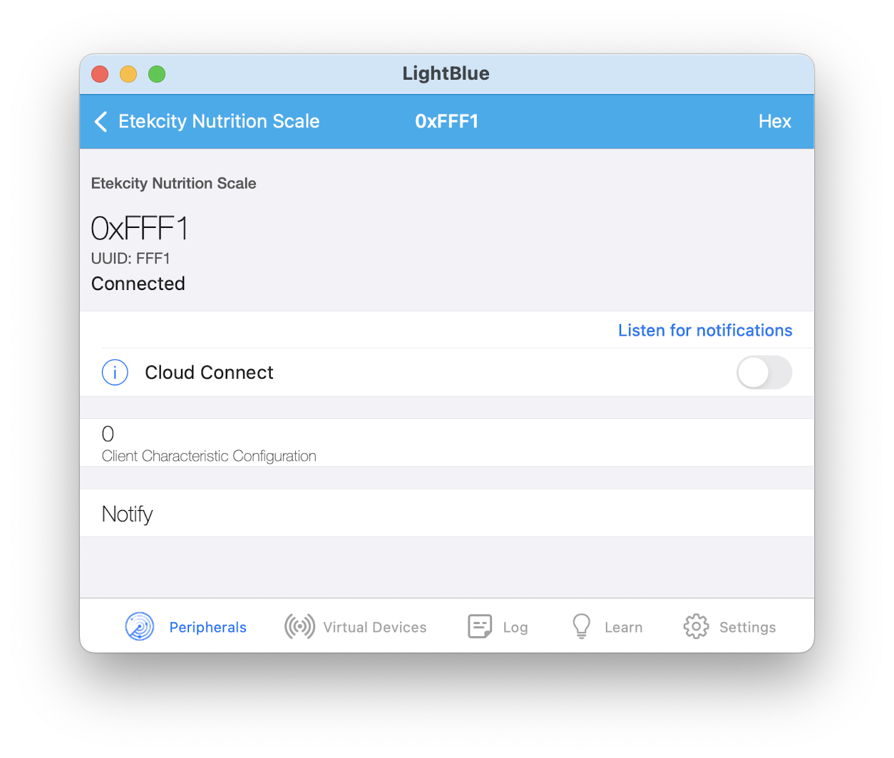
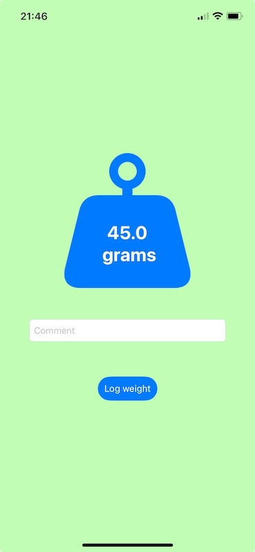

## Background

I recently had a need for a kitchen scale with some sort of data logging feature. Ideally the scale would have WiFi and push every measurement to a REST API, but I would have settled for the ability to export a .csv file with timestamps of my measurements

I couldn’t find the exact thing I was looking for, so I purchased an [Etekcity Luminary Kitchen Scale](https://etekcity.com/collections/kitchen-scales/products/eks-l221-sus-luminary-kitchen-scale). The Luminary has some pretty nice features including a 300 mAh battery charged via a USB-C port, [Bluetooth Low Energy (BLE)](https://en.wikipedia.org/wiki/Bluetooth_Low_Energy) connectivity, and the [VeSync app](https://www.vesync.com/app) for iOS and Android

I unboxed the scale and downloaded the app, but I didn’t find a way to export the timestamped .csv file full of scale measurements that I was hoping for

The BLE communication between the scale and the app should be pretty simple. Maybe I can reverse engineer it and liberate its data!

## LightBlue

[LightBlue](https://punchthrough.com/lightblue-features/) by a company called Punch through bills itself as “The Go-To BLE Development Tool” and I think that’s a fair assessment

I’m going to use the macOS version of LightBlue for this walk through but it is also available for iOS and Android

When you open LightBlue you’ll probably be prompted to give the app access to Bluetooth on your device, then you’ll see the scan screen where you can see all the BLE devices that have [advertised](https://en.wikipedia.org/wiki/Bluetooth_advertising) in the last few moments


LightBlue will show a surprising number of devices in the list! This will include your Apple devices including Mac, iPhone, AirTag, your other [Internet of things (IoT)](https://en.wikipedia.org/wiki/Internet_of_things) devices, maybe even your neighbor’s devices

You’ll need to find the device you are trying to liberate in the list. This may require some sleuthing using the whether the device is on (and advertising) or off (not advertising), [received signal strength indicator (RSSI)](https://en.wikipedia.org/wiki/Received_signal_strength_indicator) to locate the device in question, or if you’re really lucky the device will advertise an obvious name like ours did: `Etekcity Nutrition Scale` (with a relatively high RSSI, so I can infer that it’s probably not my neighbor’s)

Next, we tap the device name so LightBlue can *interrogate* it (sounds intense!)


Interrogation will reveal the device’s [services and characteristics](https://en.wikipedia.org/wiki/Bluetooth_Low_Energy). For example, we’re expecting (hoping) to find a service containing a characteristic that holds the same value as the kitchen scale’s display


## Services and characteristics

LightBlue has revealed a single service: `0xFFF0` with 2 characteristics:

1. `0xFFF2` with property: write without response
2. `0xFFF1` with property: notify

Both properties are as they sound:

1. Write without response allows the central (Mac, iPhone) to write to the peripheral (scale), but the peripheral will not provide a response indicating if the transmission was successful (or not)
2. Notify is somewhat similar and allows the scale peripheral to notify whenever the characteristic becomes available without the central responding to acknowledge receipt of the notification

I’m not sure what the write characteristic does. The scale features selectable measurement units (grams, ounces, even fluid ounces) so maybe we can write those over BLE? It might be nice to force the scale to always log with the same units. Alternatively, all the units on the scale can be converted to kilograms (or pounds)

The notify characteristic is the one we’re interested in. There is an implicit *read* before the *notify*, meaning we can read the scale measurement via this characteristic

## The notify characteristic

If we tap the `0xfff1` *notify* characteristic in LightBlue, we’ll see a button called *Listen for notifications*



Tap this button to have LightBlue *listen* to notifications for this characteristic. Each time this characteristic is updated, LightBlue will show the updated value and show a timestamped history of the recent values below


In our case, the characteristic seems to update each time the scale measurement changes

In the history of this characteristic, we see 3 entries:

1. The most recent value with darker font
    1. `0xA522810B00A90187A10000D40300020001`
2. The previous value in the lighter font in the middle:
    1. `0xA522800B00AA0187A10000D40300020001`
3. Two values back in the lighter font at the bottom:
    1. `0xA5027F0500B90178A10001`

One of these things is not like the others, can you spot it?

The 2 most recent values are longer (17 bytes) while 2 values back is shorter (11 bytes)

I was able to decode the scale measurements from the 17-byte value, so I initially regarded the 11-byte transmissions as being truncated, lost in transmission. After further research on the Etekcity scale, I found [similar work by George Hertz](https://dev.to/hertzg/hacking-ble-kitchen-scale-55io) who noted that the shorter transmissions indicated things like “err on / err off”, “tare set / update / tare off”, and “item on scale / no item on scale”. Thanks George!

## Decoding the measurements

So we can receive a 17 (or 11) byte transmission from a scale over BLE, now what?

We’ll have to decode the transmission. Luckily we have a great point of reference: the actual display on the scale which shows the measurement including units

We don’t know if the scale sends the VeSync app raw [analog to digital converter (ADC)](https://en.wikipedia.org/wiki/Analog-to-digital_converter) samples, a standard unit like grams, or whatever the units on the display says (spoiler: it’s the last one)

Why don’t we see if we can tease out the measurement from the characteristic by putting different objects on the scale, noting the measurement in a fixed unit (grams) and then seeing what bytes change

The `0xA522810B00A90187A10000D40300020001` value above was transmitted when the scale display showed `98 g`:


We can put a different object on the scale:


get a new measurement, and get a notification on our characteristic:


Now we have two references and two values to decode:

1. `98 g = 0xA522810B00A90187A10000D40300020001`
2. `18 g = 0xA5228D0B00C00187A10000B40000020001`

We should be able to get away with ignoring the common bytes between the two transmissions and focus on the differences in order to extract the data:

1. `0x10B_A9_D403`
2. `0xD0B_C0_B400`

I am not sure why there are 3 discrete sections of the transmission with different values for different readings. Having 2 sections would be understandable: a measurement field and a CRC or checksum field, but I’m not sure what the 3rd might be

We don’t really know anything about the transmission including the [endianness](https://en.wikipedia.org/wiki/Endianness), so everything should be on the table when it comes to reverse engineering

The first section is only 12 bits (maybe 16 if the most significant nibbles are both 0) but only 2 bits are unique between them which doesn’t feel like enough information to distinguish 98 and 18, so let’s keep looking

The second section is only 8 bits for a range of 256, quite a bit short of the 10 kg range of the scale. More bits probably get set for larger measurements, but let’s keep looking

The third section looks like it could be 16 bits. If we convert hex to decimal, we get `0xd403 = 54275` which seems far off from 98 g. But if we do a byte swap we get `0x03d4 = 980` which sure looks like 98.0!

If we do the same byte swapped hex to decimal on the 18 g measurement, we get `0x00b4 = 180` which looks like 18.0, awesome!

Later, I ended up reading this data in an iOS app using [Swift](https://en.wikipedia.org/wiki/Swift_(programming_language)). When reading the value of the characteristic, the byte ordering is as follows:

```text
Byte number:         0  1  2  3  4  5  6  7  8  9 10 11 12 13 14 15 16
Example sequence: 0xA5_22_81_0B_00_A9_01_87_A1_00_00_D4_03_00_02_00_01
```

We now know the measurement is at bytes 11 and 12 (little endian). There’s actually one more byte associated with the measurement: byte 10 is the sign. If the byte is 0 the sign is positive. In my code I wrote `if sign_byte > 0 then is_negative`, but I can’t remember if just a single bit gets set 

If we push the *UNIT* button on the device, we can see bytes 14 and 15 change but with an interesting pattern

It turns out that byte 14 is the *units* and byte 15 is what I called the *media*. This is a kitchen nutrition scale, so it has a way to designate if the measurement is water, milk, or neither / nothing

There’s one more byte that’s interesting to us, byte 16 is what I called the stable byte. If this byte is set to `0x01`, the reading is stable or valid. When placing or removing items from the scale, the byte goes to 0x00, presumably indicating that the reading is not stable and shouldn’t be considered valid

What we know about the Etekcity Luminary scale:

1. BLE advertised name: `Etekcity Nutrition Scale`
2. BLE service: `0xfff0`
3. BLE characteristic: `0xfff1`
4. Measurement payload length: 17 bytes
5. Sign: `byte 10`
    1. `0x00`: positive
    2. Otherwise: negative
6. Value: `bytes 11 and 12`
7. Units: `byte 14`
    1. `0x00`: ounces
    2. `0x01`: ounces
        1. The scale displays the measurement as integer pounds and fixed / fractional ounces
        2. The BLE data is identical to the `0x00` case, fixed / fractional ounces
    3. `0x02`: grams
    4. `0x03`: milliliters
    5. `0x04`: fluid ounces 
8. Media: `byte 15`
    1. `0x00`: none
    2. `0x01`: water
    3. `0x02`: milk 
9. Stable: `byte 16`
    1. `0x01`: stable
    2. Otherwise: unstable

There is some more information that we aren’t using which may include:

1. CRC or other checksum
2. Error conditions
3. Tare state 

## Web Bluetooth

There’s a little known [Web Bluetooth](https://github.com/WebBluetoothCG/web-bluetooth) standard that allows web browsers to communicate via Bluetooth. Unfortunately [there isn’t support in Apple’s Safari nor Firefox](https://caniuse.com/web-bluetooth), so there doesn’t seem to be widespread usage. We can still make a quick prototype using Google Chrome on macOS!

One thing to note is that connecting with Web Bluetooth requires a "user gesture" like a button click to initiate. Here is an example of the error message when trying to connect to Bluetooth calling from `window.onload`:

```text
Bluetooth error: DOMException: Failed to execute 'requestDevice' on 'Bluetooth':
Must be handling a user gesture to show a permission request.
```

This seems like a good move security wise in order to prevent a rogue webpage from connecting to BLE devices in your home, but it adds a little bit of friction. We can fix the above error by connecting after a button click:

```javascript
const scanButton = document.getElementById('scanButton');
scanButton.addEventListener('click', function () {
```

When building a native iOS app, the user needs to agree to give the app Bluetooth permissions just once and then is free to connect to devices upon launch, delivering a much nicer user experience

### Web Bluetooth app step by step

We can build an app to connect to the Etekcity scale in a single HTML file

1. Create a new file called `etekcity_nutrition_scale.html`
2. Add boilerplate HTML
   1. `<html>`
   2. `<head>`
   3. `<title>`
   4. `<body>`
   5. I added a `<style>` tag in the `<head>` to use CSS for monospace font
      1. `<style>#output p { font-family: monospace; }</style>`
3. Add a `<div>` to the `<body>` to display the scale measurements
      1. `<div id="output"></div>`
4. Add a `<button>` to the `<body>` to connect to Bluetooth
   1. `<button id="scanButton">Scan for Etekcity Nutrition Scale</button>`
5. Add a `<script>` for the Web Bluetooth code
6. Add a listener for when the HTML has been loaded
   1. `document.addEventListener('DOMContentLoaded', function () {`
7. Retrieve the button from the DOM:
   1. `const scanButton = document.getElementById('scanButton');`
8. Add a callback function for when the DOM button is clicked:
   1. `scanButton.addEventListener('click', function ()`
9. Use [navigator.bluetooth.requestDevice](https://webbluetoothcg.github.io/web-bluetooth/#dom-requestdeviceoptions-filters) to prompt the user to connect to a Bluetooth device
   1. We can filter the devices shown in the user prompt by:
      1. GATT service UUID (`0xfff0` for our device)
      2. Name (`Etekcity Nutrition Scale` for our device)
      3. Manufacturer specific data
      4. Service data
   2. In our case, we can filter by name and service
      1. Note that the service we intend to access must be listed as a filter
      2. `navigator.bluetooth.requestDevice({ filters: [{name: 'Etekcity Nutrition Scale'}, {services: [0xfff0]}], })`
10. At this point in the flow, the user will need to select the device from a pop-up menu
11. The `requestDevice()` function returns a promise that resolves to a BluetoothDevice object
12. The callback for the promise is defined in the `.then()` method
13. We can make a sequence of these asynchronous operations to connect to the scale and listen for the characteristic value changing
14. We can print the name of the device we found and then connect to the generic attribute profile (GATT) server: `.then(device => { console.log('Found device:', device.name); return device.gatt.connect(); })`
15. Once connected to the GATT server we request a service. In our case the 16-bit UUID is `0xfff0`: `.then(gattServer => { return gattServer.getPrimaryService(0xfff0); })`
16. And from the service we request the characteristic, in our case `0xfff1`: `.then(service => { return service.getCharacteristic(0xfff1); })`
17. Next, we set up a callback function for notifications from the characteristic:
`.then(characteristic => { characteristic.addEventListener('characteristicvaluechanged', handleCharacteristicValueChanged); return characteristic.startNotifications(); })`
18. We print to the console that the listener for the notifications was set up successfully: `.then(() => { console.log('Notifications started'); })`
19. Finally, we catch any errors in the initialization sequence: `                .catch(error => { console.error('Bluetooth error:', error); });`
20. Now we need to define the callback for when we get a notification from our characteristic of interest: `function handleCharacteristicValueChanged(event) {`
21. We can access the value of the characteristic that notified us using: `const value = event.target.value;`
22. We know we only want to try and decode 17 byte values: `if (value.byteLength === 17) {`
23. We save specific bytes of the value to appropriately named variables
    1. Sign at byte 10 `let scaleSign = value.getUint8(10);`
    2. Value at bytes 11 and 12 (little endian): `let scaleValue = value.getUint16(11, true);`
    3. Units at byte 14: `let scaleUnitHex = value.getUint8(14);`
    4. Media at byte 15: `let scaleMediaHex = value.getUint8(15);`
    5. Stable at byte 16: `let scaleStableHex = value.getUint8(16);`
24. We add some logic to turn units and media into human-readable values
25. We add some logic to handle the sign and a scale factor
26. Finally, we log the newly decoded values to the console and HTML `<div>`
    1. To avoid confusing scrolling while values are streaming in, we append the newest reading at the top of the HTML page
    2. Each reading is prepended with an epoch timestamp in milliseconds
    3. Each reading is also prepended with:
       1. `stable` if the reading is indicated as stable
       2. `unstbl` if the reading is not indicated as stable
    4. The reading including any scaling factor is printed
    5. The units are printed
    6. The media is printed

```javascript
const outputDiv = document.getElementById('output');
const newLine = document.createElement('p');
newLine.textContent = new Date().getTime() + ' ' + scaleStable + scaleValue + ' ' + scaleUnit + ' ' + scaleMedia;
outputDiv.insertBefore(newLine, outputDiv.firstChild);
```

Here's the HTML page (and JavaScript console):


Here's connecting to the scale:


And here's streaming scale readings:


Awesome, we made an HTML *app* that connects to a BLE scale and streams the readings to the screen!

As mentioned, Safari doesn't support these features. I was able to successfully use the browser [nuviu](https://www.nuviu-browser.com) on iOS to use Web Bluetooth

It's nice to have that option, but between requesting someone download a relatively unknown browser and the Web Bluetooth security features making the experience a little tedious, we could try building a native app

## Swift app

Let's build a similar app in Swift. We'll target a macOS command line interface (CLI) app to focus on BLE connectivity rather than UI design

### macOS Swift CLI app step by step

In [Apple Xcode](https://developer.apple.com/xcode/), we'll need to create a new macOS CLI app:


I named mine `etekcity_nutrition_cli` and saved it in `~/work`:


1. We'll need to import [CoreBluetooth](https://developer.apple.com/documentation/corebluetooth): `import CoreBluetooth`
2. We need to define a class for our Bluetooth Controller: `class BLEController: NSObject, ObservableObject, CBCentralManagerDelegate, CBPeripheralDelegate {`
   1. The class will inherit from [NSObject](https://developer.apple.com/documentation/objectivec/nsobject)
   2. The class will conform to: [ObservableObject](https://developer.apple.com/documentation/Combine/ObservableObject), [CBCentralManagerDelegate](https://developer.apple.com/documentation/corebluetooth/cbcentralmanagerdelegate/), and [CBPeripheralDelegate](https://developer.apple.com/documentation/corebluetooth/cbperipheraldelegate)
3. We define the 16-bit service UUID we are connecting to: `let scaleServiceUUID = CBUUID.init(string: "fff0")`
4. And the 16-bit characteristic UUID we would like to receive notifications from: `let scaleCharacteristicUUID = CBUUID.init(string: "fff1")`
5. We instantiate a [CBCentralManager](https://developer.apple.com/documentation/corebluetooth/cbcentralmanager): `var myCentral: CBCentralManager!`
6. We instantiate a [CBPeripheral](https://developer.apple.com/documentation/corebluetooth/cbperipheral/) to interact with the scale
7. We initialize our class and the `NSObject` superclass: `super.init()`
8. We initialize the instance of `CBCentralManager`: `myCentral = CBCentralManager(delegate: self, queue: nil)`
9. We use `centralManagerDidUpdateState` to when `CBManagerState` has changed states: 
   1. If `CBManagerState` is `poweredOn`, Bluetooth is powered on and ready to use
10. Now we can start scanning for the scale. We'll make a function to start scanning since we'll also use it if we get disconnected. We tell the central to scan for peripherals: `myCentral.scanForPeripherals(withServices: nil, options: nil)`
11. The [centralManager(_:didDiscover:advertisementData:rssi:)](https://developer.apple.com/documentation/corebluetooth/cbcentralmanagerdelegate/1518937-centralmanager/) function gets called when the central discovers a peripheral while scanning
12. Since we didn't provide any filters to `myCentral.scanForPeripherals`, we need to check the name of each peripheral the central finds while scanning
13. We use *nil coalescing* to set a default value if the `peripheral.name` is `nil`: `let unwrappedBLEName = peripheral.name ?? "NoBLEName"`
14. If we find a peripheral with a matching name of "Etekcity Nutrition Scale"
15. We stop scanning: `central.stopScan()`
16. We connect to the peripheral: `central.connect(scalePeripheral, options: nil)`
17. The [centralManager(_:didConnect:)](https://developer.apple.com/documentation/corebluetooth/cbcentralmanagerdelegate/1518969-centralmanager/) function gets called when the central connects to a peripheral
18. We can now discover services of the connected peripheral: `peripheral.discoverServices(nil)`
19. The [peripheral(_:didDiscoverServices:)](https://developer.apple.com/documentation/corebluetooth/cbperipheraldelegate/1518744-peripheral/) function gets called when the peripheral's services have been discovered
20. For each service discovered in the peripheral, we scan for characteristics: `peripheral.discoverCharacteristics(nil, for: service)`
21. The [peripheral(_:didDiscoverCharacteristicsFor:error:)](https://developer.apple.com/documentation/corebluetooth/cbperipheraldelegate/1518821-peripheral/) function gets called when the service's characteristics have been discovered
22. The service's UUID is printed
23. The characteristic's UUID is printed
24. The characteristic's properties (read, write without response, or notify) are printed
25. If the characteristic has the `notify` property, we can enable notifications for this characteristic: `peripheral.setNotifyValue(true, for: characteristic)`
26. The [centralManager(_:didDisconnectPeripheral:error:)](https://developer.apple.com/documentation/corebluetooth/cbcentralmanagerdelegate/1518791-centralmanager/) function is called if the central manager gets disconnected from a peripheral
    1. We start scanning for the scale again
27. The [peripheral(_:didUpdateValueFor:error:)](https://developer.apple.com/documentation/corebluetooth/cbperipheraldelegate/1518708-peripheral/) function gets called when the `notify` characteristic changes
28. If the received value is 17 bytes, decode the relevant bytes and display the measurement received


## Conclusion

Wow, we sure covered a lot. To recap, we learned:

1. How to interrogate a Bluetooth Low Energy peripheral using the app LightBlue
2. How to decode a weight measurement from a scale peripheral's notify characteristic
3. How to build a Web Bluetooth app in HTML and JavaScript to receive, decode, and display the scale's characteristic
4. How to build a macOS CLI app in Swift to receive, decode, and display the scale's characteristic

If I were to revisit this project I would:

1. Learn about the 11 byte transmissions from the scale
2. Fully decode the 17 byte transmissions including CRC
3. Sniff for the write transmissions from the official app to the scale

Meanwhile, I did end up building a UI in Swift UI targeting iOS and iPadOS. This app also included writing measurements to a database via a REST API


