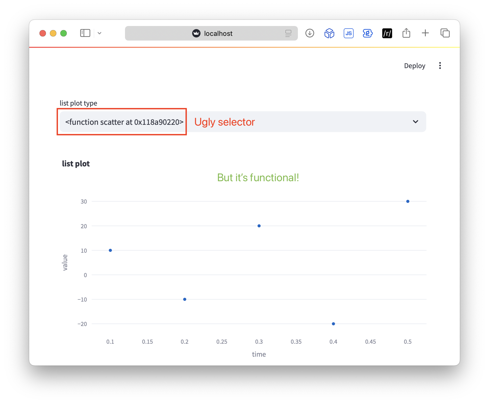
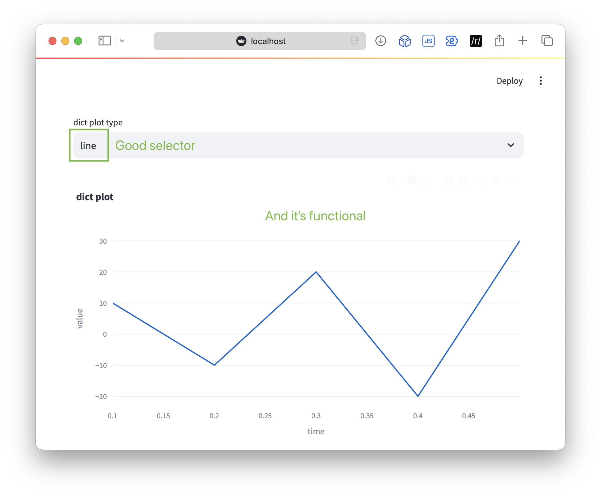
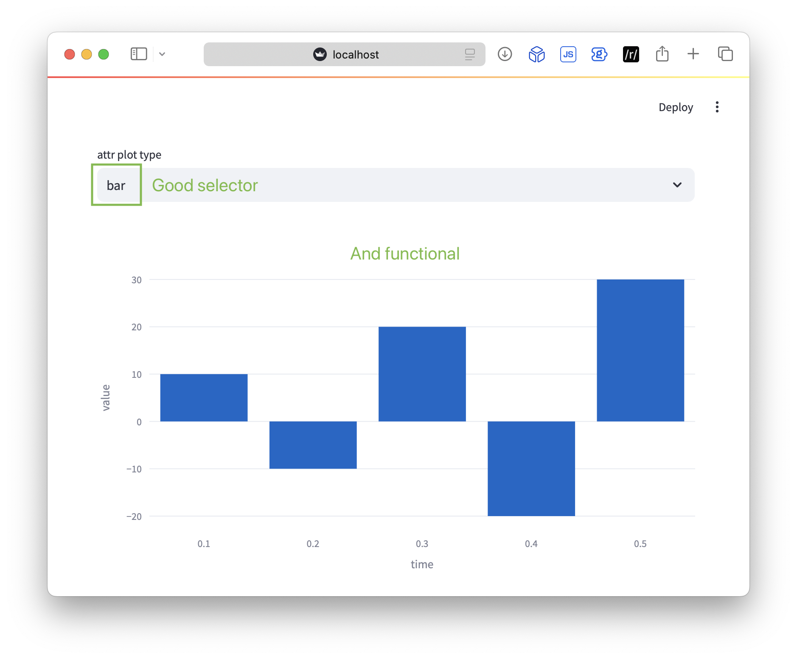

I have to admit, writing relatively simple tips and tricks feels a little quaint in an LLM world

On the other hand, you don't know what you don't know, discoverability is hard, and we must feel the LLMs

## Background

I was recently building a dashboard with [Streamlit](https://streamlit.io) that generated plots with [Plotly](https://plotly.com). This is a pretty typical workflow for me, but this time I wanted to be able to select the type of chart from a [Streamlit selectbox](https://docs.streamlit.io/develop/api-reference/widgets/st.selectbox) which accepts lists, sets, dicts, and similar datatypes as the selection options. The parameters don't change across the different plot types, so duplicating code just because the function name changed felt a little sloppy

To add one more layer of complexity, I wanted the ability to store this (function) selection as plain text in a URL or database, so I could make things more stateful

## Solutions

To clarify the problem a little bit, let's assume I'm using Streamlit and Plotly Express and have imported the packages and generated some data:

```python
import streamlit as st
import plotly.express as px

data = {
    'time': [0.1, 0.2, 0.3, 0.4, 0.5],
    'value': [10, -10, 20, -20, 30]
}
```

I want to be able to select the *type* of plot from a `selectbox`:

1. Scatter plot: `px.scatter(...)`
2. Line plot: `px.line(...)`
3. Bar plot: `px.bar(...)`

There are [many other useful plots in Plotly Express](https://plotly.com/python/plotly-express/), but for simplicity let's focus on these 3

### A list of functions

In Python, we have the luxury of *first class functions*, they are handled just like non-function values. This means that can be stored in data structures and passed as arguments among other things. We're interested in that first one, storing them in data structures

This must mean we can create a list of functions to feed to the `selectbox` as `options`:

```python
options_list = [px.scatter, px.line, px.bar]
```

We can provide this list as the `options` parameter in Streamlit's `selectbox`, generate a figure, and display it:

```python
list_plot_type = st.selectbox("list plot type", options_list)

list_fig = list_plot_type(data, x="time", y="value", title="list plot")
st.plotly_chart(list_fig)
```

While this does technically work, the `selectbox` displays the [identity](https://docs.python.org/2/library/functions.html#id) of the function objects, which isn't the nicest user interface



I'm also not sure that we can store `plot_type` as plain text to save the configuration

*If only* we could map the function ids to a nice, human-readable name

### A dict of functions

Luckily there's a convenient data structure to map a name (ehem, *key*) to a value: a [dictionary](https://docs.python.org/3/tutorial/datastructures.html#dictionaries)

First, we create the dictionary of names to functions:

```python
options_dict = {"scatter": px.scatter, "line": px.line, "bar": px.bar}
```
Then we feed the user-friendly keys to the `selectbox`:

```python
dict_plot_type = st.selectbox("dict plot type", options_dict.keys())
```
Finally, we use key-based access to call the function in the value associated with the selected key:

```python
dict_fig = options_dict[dict_plot_type](data, x="time", y="value", title="dict plot")
st.plotly_chart(dict_fig)
```



Sweet! That not only works, but the UI looks nice too

We can store the plain text key and use it to set the initial value of the `selectbox`. Since the initial value is set with an integer index, we need to jump through some hoops in order to populate it with a dictionary key:

```python
dict_plot_type = st.selectbox("dict plot type", options_dict.keys(), index=list(options_dict.keys()).index("line"))
```

We cast the dictionary keys to a list, then get the index of the key we are looking for. This isn't the prettiest code, but at least the UI is improved compared to the list-only version

### Using getattr()

There's one more way I can think of to solve this problem: using Python's builtin [getattr()](https://docs.python.org/3/library/functions.html#getattr) to return the named attribute of the object

To use `getattr()`, we'll start with the `selectbox` with a `list` of `options` that include the names of the 3 functions of `px` that we are interested in. We can initialize the index using a simpler version of the `list` `.index()` we used in the `dict` example

Then we assign a variable (`px_plot`) to `getattr` of `px` and the value returned by the `selectbox`: `attr_plot_type`

We call this new variable in place of the original `<imported namespace>.<function>`:

```python
attr_options = ["scatter", "line", "bar"]
attr_plot_type = st.selectbox("attr plot type", options=attr_options, index=attr_options.index("bar"))
px_plot = getattr(px, attr_plot_type)

# fig = px.bar(data, x="time", y="value")       # normally we'd plot like this
attr_fig = px_plot(data, x="time", y="value")   # with getattr() we plot like this
st.plotly_chart(attr_fig)
```



## Conclusion

While I think the `getattr` solution is slick, as soon as we want to rename functions we'll need a `dict`, and at that point we'll probably want to use the `dict` solution entirely

Here's [test.py](test.py) which was used for testing these methods and generating the plots. You'll need to:

```bash
# setup and source a venv
pip install streamlit plotly
```

then:

```bash
streamlit run test.py
```

Streamlit will run, open a browser, and generate the plots you see above

Now you know a thing or 3 about *first class functions* in Python!
