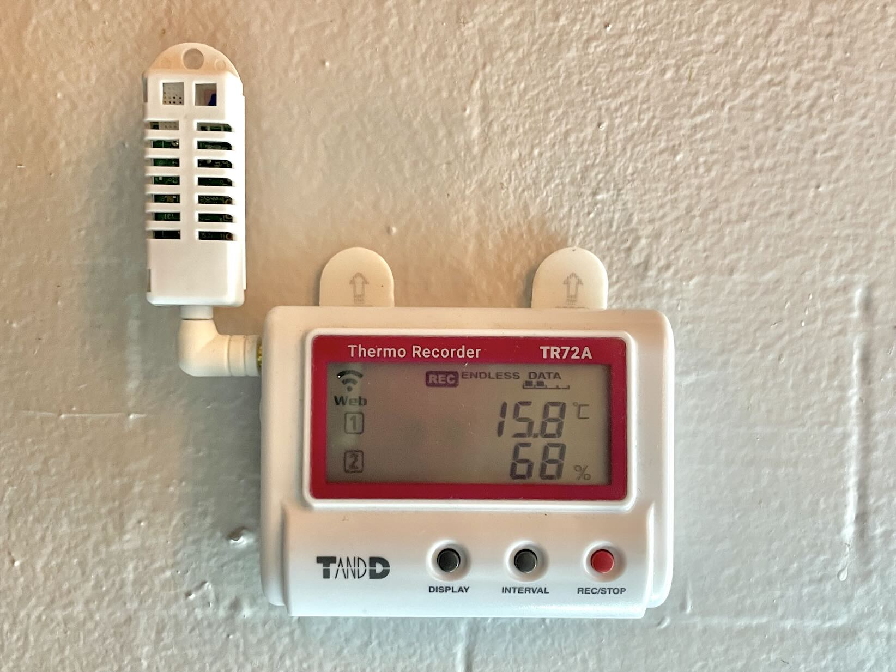
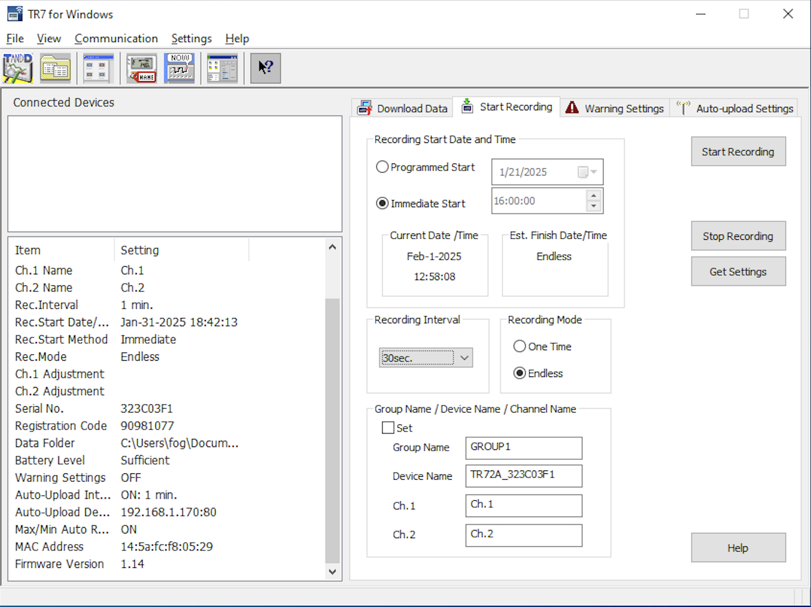
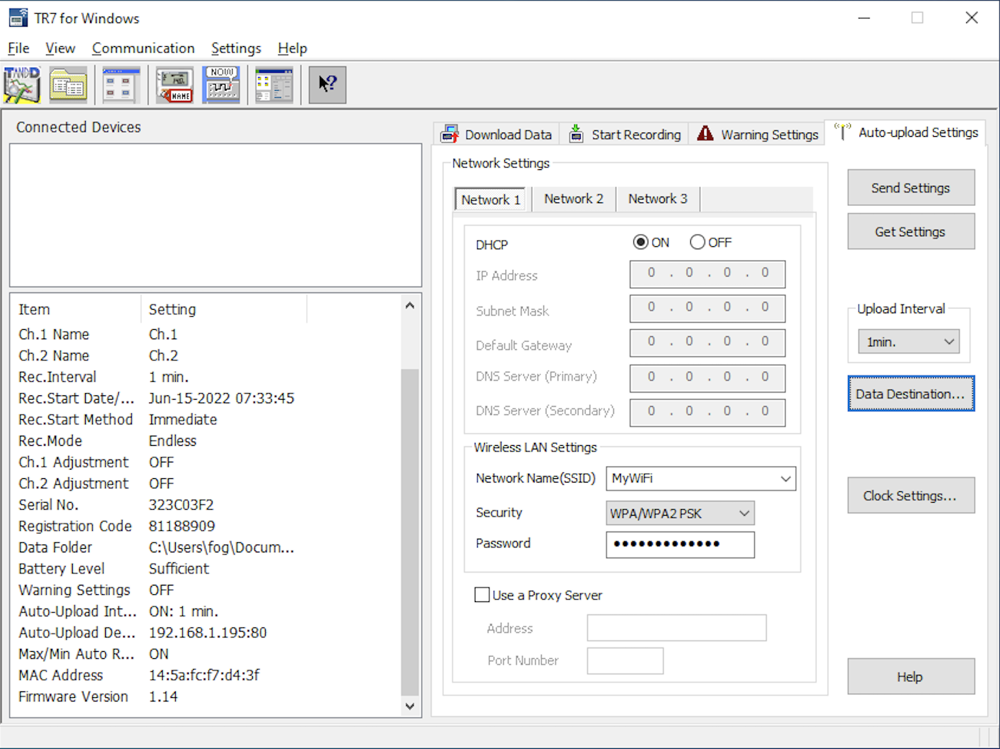
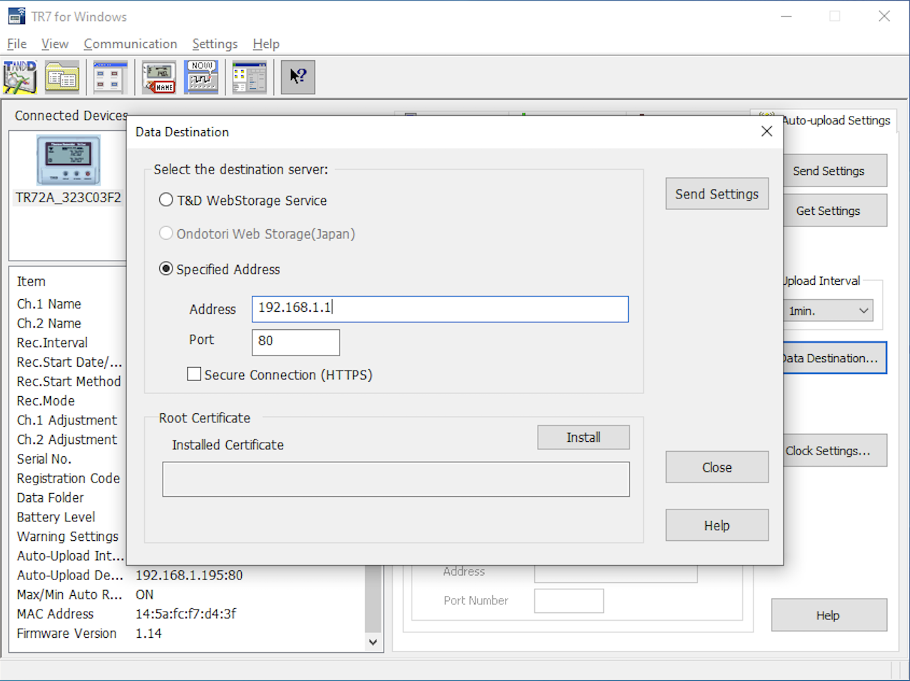
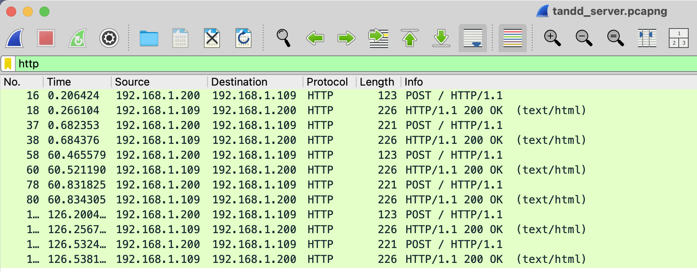
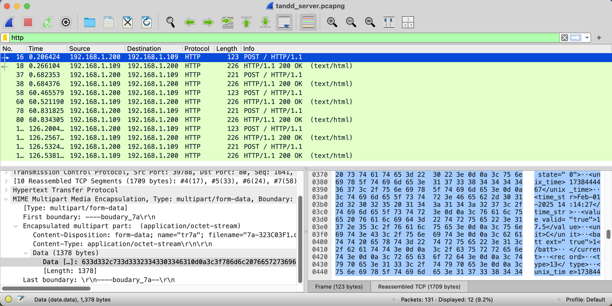
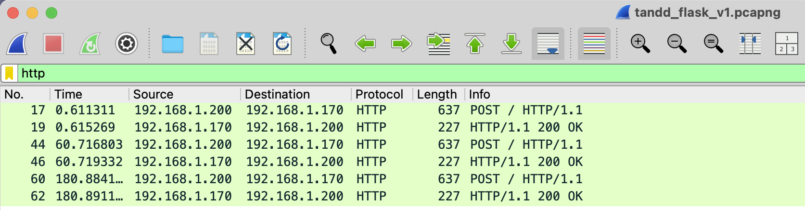

I feel kind of silly calling this post reverse engineering. There's no deep [Ghidra](https://ghidra-sre.org) or [IDA Pro](https://hex-rays.com/ida-pro) work here. But there is using [Wireshark](https://www.wireshark.org) to liberate the data from an off the shelf data logger, so let's just go with it :)

# Background

I have a few temperature and humidity data loggers made by a Japanese company called [TandD](https://tandd.com/)



These cute little loggers have a display for realtime readings, on-board memory for offline logging, and both BLE and Wi-Fi connectivity. They also offer *free* cloud data logging which is nice (what, no SaaS?)

But what if we wanted to build our own backend for these sensors? Maybe our data is sensitive. Maybe there's no internet connectivity. Or maybe we just like making things a little harder than they need to be

# The sensor

We are using the TR72A which looks like it has been replaced with the [TandD TR72A](https://tandd.com/product/tr72a2/)

The TR72 can be configured in a couple ways:

1. Using a Windows application via a USB cable
2. Using an iOS / Android app via BLE

Details can be found in the [User Manual](https://tandd.com/manual/pdf/man-users-tr7a-eng.pdf)

I only used the Windows route, but I should check to see if the same features are available in the mobile app

## The Windows application

*TR7 for Windows* allows you to configure all kinds of settings on the device. First we need to set the *Recording Interval* on the *Start Recording* tab

The fastest upload interval is 1 minute, so setting *Recording Interval* faster than 1 minute will buffer multiple samples and upload them at 1 minute intervals. We don't know if messages can contain more than 1 sample, so we'll set the recording interval to 30 seconds to find out

You'll need to push *Start Recording* to set *Recording Interval*. You can confirm the setting with the *Get Settings* button



Next, switch to the *Auto-upload Settings* tab



Here we set:

1. In my (or most) cases *DHCP* set to *ON*
    1. Set appropriately for your network
2. *Wireless LAN Settings* box
   1. *SSID* selector
   2. *Security* selector
   3. *Password* field
   4. Set appropriately for your network
3. *Upload Interval* selector
   1. Set to your desired sample interval
   2. The fastest rate is 1 minute. I recommend the fastest for development
4. *Data Destination* button
    1. We'll dive in here next
5. Use the *Get Settings* and *Send Settings* to set and confirm your settings

### Data Destination

You'll need to plug a TandD device in in order to be able to click the *Data Destination* button. Be warned, this requires the most obscure of USB cables: the [USB Mini-B](https://en.wikipedia.org/wiki/USB#Connector_type_quick_reference). 

**Note:** a USB Mini-B cable does come in the box :)

Upon clicking into *Data Destination*, you'll quickly see the inspiration for this post: 



The first radio button selects the *T&D WebStorage Service*, aka the free cloud data logging. Below the greyed-out *Ondotori Web Storage(Japan)* selection is the delightfully simple *Specified Address* selection along with fields for *[IP] Address* and *Port* as well as a checkbox for *Secure Connection (HTTPS)*. Finally, you'll see a way to install a [Root Certificate](https://en.wikipedia.org/wiki/Root_certificate)

Great, we can just put a web server up and collect sweet, sweet temperature and humidity samples from the TR72A

# Our own HTTP server

This next part requires an HTTP server. I do a lot of Python, so let's use [Flask](https://en.wikipedia.org/wiki/Flask_(web_framework))

## Create a Python project using `uv`

I'm also going all in on [Astral uv](http://docs.astral.sh/uv/), so I'm going to write instructions as if you've already installed `uv`

Let's create a new project:

```bash
uv init tandlogger
```

Let's change into the directory and add Flask as a dependency:

```bash
cd tanddlogger
uv add Flask
```

I'm going to rename the default `hello.py` to `tanddserver.py`:

```bash
mv hello.py tanddserver.py
```

## Flask server v1

Now for the actual server. Let's edit `tanddserver.py` to be:

```python
from flask import Flask, request

app = Flask(__name__)


@app.route("/", methods=["GET", "POST"])
def handle_request():
    app.logger.info(f"Method: {request.method}")
    app.logger.info(f"Headers: {dict(request.headers)}")
    app.logger.info(f"Args: {request.args.to_dict()}")
    app.logger.info(f"Form Data: {request.form.to_dict()}")
    app.logger.info(f"Files: {request.files.to_dict()}")

    for filename, file in request.files.items():
        file_content = file.read().decode("utf-8", errors="ignore")
        app.logger.info(f"File: {filename}, Content: {file_content}")
        file.seek(0)  # Reset file pointer after reading

    app.logger.info(f"JSON Data: {request.get_json(silent=True)}")
    app.logger.info(f"Raw Data: {request.data.decode('utf-8')}")
    return "", 200


if __name__ == "__main__":
    app.run(host="0.0.0.0", port=80, debug=True)
```

This sets up a single [route](https://flask.palletsprojects.com/en/stable/api/#flask.Flask.route) at the root URL (/) that supports `GET` or `POST` methods and logs everything you could possibly want to know about the request

We can run this server with:

```bash
uv run python tanddserver.py
```

**Note:** you may need to add `sudo` to use port 80 on some systems. You could also set the TandD to connect to the Flask default port: 5000

If successful, you'll see something like this:

```
uv run python tanddserver.py
 * Serving Flask app 'tanddserver'
 * Debug mode: on
WARNING: This is a development server. Do not use it in a production deployment. Use a production WSGI server instead.
 * Running on all addresses (0.0.0.0)
 * Running on http://127.0.0.1:80
 * Running on http://192.168.1.170:80
Press CTRL+C to quit
 * Restarting with stat
 * Debugger is active!
 * Debugger PIN: 398-386-467
```

You should eventually see a ping from the sensor:

```
[2025-02-01 13:33:56,614] INFO in tanddserver: Method: POST
[2025-02-01 13:33:56,615] INFO in tanddserver: Headers: {'User-Agent': 'TandD device (TR7A)', 'Connection': 'keep-alive', 'Content-Type': 'multipart/form-data; boundary=--boudary_7a', 'Host': '192.168.1.170:80', 'Content-Length': '583'}
[2025-02-01 13:33:56,615] INFO in tanddserver: Args: {}
[2025-02-01 13:33:56,617] INFO in tanddserver: Form Data: {}
[2025-02-01 13:33:56,617] INFO in tanddserver: Files: {'tr7a': <FileStorage: '7a-323C03F1.dat' ('application/octet-stream')>}
[2025-02-01 13:33:56,617] INFO in tanddserver: File: tr7a, Content: c=4,s=323C03F1
<2'gDD<TR72A_323C03F1GROUP1Ch.1Ch.2wZ)1.011.141.00 <
[2025-02-01 13:33:56,617] INFO in tanddserver: JSON Data: None
[2025-02-01 13:33:56,617] INFO in tanddserver: Raw Data:
192.168.1.200 - - [01/Feb/2025 13:33:56] "POST / HTTP/1.1" 200 -
```

So we made contact, but I don't see any signs of temperature or humidity data. All the successive data is very similar – if not identical 

# Wireshark

Maybe we were a little overly eager to write our own TandD server without sniffing the traffic to the Windows server with [Wireshark](https://www.wireshark.org) first

1. Install Wireshark
2. Open Wireshark and select the appropriate network interface (`Wi-Fi: en0` or a similar)
3. Set a capture filter of `port 80 and (src host 192.168.1.1 or dst host 192.168.1.1)` where `192.168.1.1` is the IP of the computer running Flask
4. Click the blue fin at the upper left to start the capture
5. Wait for a packet

## Wireshark TandD server

You can open my [TandD Windows server capture](files/tandd_server.pcapng) in [pcapng format](https://wiki.wireshark.org/Development/PcapNg) with Wireshark. Add a display filter for `http` to hide the noisy TCP packets

I left the capture on for 3 transmissions from the TR72A:



There's a lot to note in this short capture

1. The device had a transmission interval of 60 seconds followed by 66 seconds. This seems like a considerable amount of jitter, hopefully the samples themselves contain timestamps
2. The device uses the POST method exclusively
3. There are 2 POSTs from the device when we really only expected 1 (take a look at the time column and notice there are 2 POSTs in each interval)

Maybe if we rummage around the POSTs, we can find the actual temperature and humidity data



If you squint at the *Reassembled TCP* highlighted in blue, you can see some [XML](https://en.wikipedia.org/wiki/XML) that reads:

```xml
<value>17.5</value>
<unit>C</unit>
```

Hurray, that's what we've been looking for!

We've proven that the temperature (and presumably humidity) data is transmitted over clear text HTTP as an XML file as part of a POST request. We can work with this

## Wireshark Flask server

Now let's figure out why our Flask server doesn't receive the same data

Here is the [Flask v1 capture](files/tandd_flask_v1.pcapng)



Interesting things:

1. This time we seem to have skipped a POST at 120 seconds
2. The interval looks a lot closer to 60 seconds (save for the dropped POST)
3. The most interesting: there is only 1 POST per interval

## What's the difference?

When spelunking through the two captures, I identified 2 differences:

1. The TandD server implements [HTTP persistent connection](https://en.wikipedia.org/wiki/HTTP_persistent_connection)
   1. The Flask server closes the connection
2. The TandD server has an [HTTP status line](https://en.wikipedia.org/wiki/HTTP#HTTP/1.1_response_messages) that alternates between
   1. `R=3,0\r\n` when the POST contains the XML containing sensor readings
   2. `R=2,0\r\n` for the more basic POST

Let's revisit the Flask server

# Flask server v2

Since we figured out that the server gives different responses based on the type of POST, why don't we implement that?

Here's the updated code:

```python
from flask import Flask, request

app = Flask(__name__)


@app.route("/", methods=["POST"])
def handle_request():
    app.logger.info(f"Method: {request.method}")
    app.logger.info(f"Headers: {dict(request.headers)}")
    app.logger.info(f"Args: {request.args.to_dict()}")
    app.logger.info(f"Form Data: {request.form.to_dict()}")
    app.logger.info(f"Files: {request.files.to_dict()}")

    contains_xml = False

    for filename, file in request.files.items():
        file_content = file.read().decode("utf-8", errors="ignore")
        app.logger.info(f"File: {filename}, Content: {file_content}")
        file.seek(0)

        if "<?xml" in file_content:
            contains_xml = True

    response_text = "R=3,0\r\n" if contains_xml else "R=2,0\r\n"

    return response_text, 200


if __name__ == "__main__":
    app.run(host="0.0.0.0", port=80, debug=True)
```

## Running Flask server v2

We now have a beautiful XML file logged to the terminal:

```xml
<?xml version="1.0" encoding="UTF-8"?>
<file format="current_readings" version="1.26" name="323C03F1_1738452112.xml">
<base>
<serial>323C03F1</serial>
<model>TR72A</model>
<name>TR72A_323C03F1</name>
<time_diff>-480</time_diff>
<std_bias>0</std_bias>
<dst_bias>60</dst_bias>
<time_zone></time_zone>
</base>
<group>
<num>0</num>
<name>GROUP1</name>
<remote>
<serial>323C03F1</serial>
<model>TR72A</model>
<num>1</num>
<name>TR72A_323C03F1</name>
<rssi></rssi>
<ch>
<num>1</num>
<scale_expr></scale_expr>
<name>Ch.1</name>
<current state="0">
<unix_time>1738452087</unix_time>
<time_str>Feb-01-2025 16:21:27</time_str>
<value valid="true">16.4</value>
<unit>C</unit>
<batt ext="true">1</batt>
</current>
<record>
<type>13</type>
<unix_time>1738451817</unix_time>
<data_id>284</data_id>
<interval>30</interval>
<count>10</count>
<data>
jASMBIwEjASMBIwEjASMBIwEjAQ=
</data>
</record>
</ch>
<ch>
<num>2</num>
<scale_expr></scale_expr>
<name>Ch.2</name>
<current state="0">
<unix_time>1738452087</unix_time>
<time_str>Feb-01-2025 16:21:27</time_str>
<value valid="true">73</value>
<unit>%</unit>
<batt ext="true">1</batt>
</current>
<record>
<type>208</type>
<unix_time>1738451817</unix_time>
<data_id>284</data_id>
<interval>30</interval>
<count>10</count>
<data>
wgbMBswGzAbCBsIGwgbCBsIGwgY=
</data>
</record>
</ch>
</remote>
</group>
</file>
```

Let's pull out the temperature data:

```xml
<unix_time>1738452087</unix_time>
<time_str>Feb-01-2025 16:21:27</time_str>
<value valid="true">16.4</value>
<unit>C</unit>
```

We have:

1. An Unix timestamp
2. A wrong timezone timestamp string
3. A fixed point number
4. A valid flag for the fixed point number
5. A unit

Now the humidity data:

```xml
<unix_time>1738452087</unix_time>
<time_str>Feb-01-2025 16:21:27</time_str>
<value valid="true">73</value>
<unit>%</unit>
```

Similar, but the unit is `%` for relative humidity

Is there anything more lurking?

```xml
<unix_time>1738452087</unix_time>
<time_str>Feb-01-2025 16:21:27</time_str>
<value valid="true">16.4</value>
<unit>C</unit>
<batt ext="true">1</batt>
</current>
<record>
<type>13</type>
<unix_time>1738451817</unix_time>
<data_id>284</data_id>
<interval>30</interval>
<count>10</count>
<data>
jASMBIwEjASMBIwEjASMBIwEjAQ=
</data>
</record>
```

This looks kind of interesting, a `<data>` tag preceded by a type, Unix timestamp, data ID, interval, and count

We set our interval to 30 seconds, so that checks out. The data field looks like it could be a count of 10 readings, maybe [Base64 encoded](https://en.wikipedia.org/wiki/Base64). Let's find out, here's some Python test code:

```Python
import base64
import struct

encoded_data = "jASMBIwEjASMBIwEjASMBIwEjAQ="

decoded_bytes = base64.b64decode(encoded_data)
decoded_values = list(struct.unpack("<" + "h" * (len(decoded_bytes) // 2), decoded_bytes))

print(decoded_values)
```

```
❯ uv run python test.py
[1164, 1164, 1164, 1164, 1164, 1164, 1164, 1164, 1164, 1164]
```

We have 10 repeating numbers that should be temperature. We had a `value` of 16.4 in the same XML, so this does look like temperature data. I'm unsure what the leading 1 is, maybe a weird signed representation? I don't expect to go near 100 or 0 °C, so I am probably satisfied with the mystery for now

What about the humidity `<data>`?

```xml
<unix_time>1738452087</unix_time>
<time_str>Feb-01-2025 16:21:27</time_str>
<value valid="true">73</value>
<unit>%</unit>
<batt ext="true">1</batt>
</current>
<record>
<type>208</type>
<unix_time>1738451817</unix_time>
<data_id>284</data_id>
<interval>30</interval>
<count>10</count>
<data>
wgbMBswGzAbCBsIGwgbCBsIGwgY=
</data>
</record>
```

**Note:** the `type` is different from the temperature readings, so we can distiguish the `<data>` between the two sensors

```
❯ uv run python test.py
[1730, 1740, 1740, 1740, 1730, 1730, 1730, 1730, 1730, 1730]
```

Our nominal humidity reading was 73, so if we go along with the same signed representation we have values ranging 73 - 74 %RH. Wonderful!

But what are the timestamps associated with the buffered data? There is a Unix timestamp as part of the record. If we look really closely, we can see the *record* timestamp is earlier in time than the Unix timestamp near the `<value>`

```
1738452087 - 1738451817
= 270
```

Excellent, the *record* timestamp is 270 seconds before the `<value>` timestamp which is about what I'd expect for a count of 10 samples

# Reflecting on the TR72A

The ability to buffer data locally and "catch up" once there is connectivity again makes the TandD sensor a pretty compelling package

Of course one could implement something similar with a [Sensirion SHT40](https://sensirion.com/products/catalog/SHT40I-BD1B) temperature and humidity sensor and an [ESP32 microcontroller](https://en.wikipedia.org/wiki/ESP32) or something in the [Raspberry Pi family](https://en.wikipedia.org/wiki/Raspberry_Pi#Series_and_generations), but the now you're building a data logger instead of collecting data

# Flask server v3

Let's build a Flask server that decodes the `<data>` buffer and inserts it into a [pandas](https://pandas.pydata.org) dataframe so we can save it as a csv or parquet file

## Code

What we need to do:

1. Remove the log messages we used to understand the HTTP requests from the TR72A
2. Look for POST requests that have a POST content type of `multipart/form-data`
3. Look for `<?xml` in the file content
4. Get the device serial number from `/group/remote/serial`
   1. This will be useful if we log multiple sensors
5. Get the record from the XML path: `/group/remote/ch/record`
   1. For each `ch`
6. Map
   1. `type = 13` to temperature in Celsius
   2. `type = 289` to relative humidity
7. Generate `count` timestamps from `unix_time` incrementing by `interval` seconds
8. Base64 decode the `<data>` string
9. Interpret each sequence of 2 bytes as an integer
10. Convert the integer to a floating point number in the expected range
    1. Subtract 1000 from the integer
    2. Divide the difference by 10
    3. `float = (int - 1000) / 10`
11. Store each float with the appropriate timestamp

Here is the result:

```python
import base64
import os
import pandas as pd
import struct

from dataclasses import dataclass
from flask import Flask, request
from xml.etree import ElementTree as ET

file_path = "log.csv"


@dataclass
class SensorMapping:
    temp_c: str = "13"
    rh: str = "208"

    def get_field_name(self, code: str) -> str:
        mapping = {self.temp_c: "temp_c", self.rh: "rh"}
        return mapping.get(code, "Unknown")


@dataclass
class SensorReading:
    unix_time: int
    serial: str
    sensor: str
    reading: float


app = Flask(__name__)

mapping = SensorMapping()


@app.route("/", methods=["POST"])
def handle_request():
    contains_xml = False

    for filename, file in request.files.items():
        try:
            file_content = file.read().decode("utf-8", errors="ignore")
        except Exception as e:
            app.logger.warning(f"Failed to read {filename}: {e}")

        if "<?xml" in file_content:
            contains_xml = True

            xml_only = "<?xml" + file_content.split("<?xml", 1)[1]

            try:
                xml_root = ET.fromstring(xml_only)
            except Exception as e:
                app.logger.warning(f"Failed to build XML tree for {filename}: {e}")

            df_list = []

            try:
                device_serial = xml_root.find("./base/serial").text

                for ch in xml_root.findall(".//ch"):
                    record_type = ch.find("./record/type").text
                    record_start = int(ch.find("./record/unix_time").text)
                    record_count = int(ch.find("./record/count").text)
                    record_interval = int(ch.find("./record/interval").text)
                    record_data = ch.find("./record/data").text

                    decoded_bytes = base64.b64decode(record_data)
                    reading_list = list(
                        struct.unpack(
                            "<" + "h" * (len(decoded_bytes) // 2), decoded_bytes
                        )
                    )
                    reading_list = [(x - 1000) / 10.0 for x in reading_list]

                    timestamp_list = [
                        record_start + i * record_interval for i in range(record_count)
                    ]

                    sensor_readings = [
                        SensorReading(
                            unix_time=timestamp,
                            serial=device_serial,
                            sensor=mapping.get_field_name(record_type),
                            reading=reading,
                        )
                        for timestamp, reading in zip(timestamp_list, reading_list)
                    ]

                    df_list.append(
                        pd.DataFrame([reading.__dict__ for reading in sensor_readings])
                    )
            except Exception as e:
                app.logger.warning(f"Failed to parse {filename}: {e}")

            if len(df_list) > 0:
                try:
                    df = pd.concat(df_list)
                    df = df.sort_values("unix_time")
                except Exception as e:
                    app.logger.warning(f"Failed to concatenate and sort df_list: {e}")

                app.logger.info("Sensor readings")
                app.logger.info(df)

                if os.path.exists(file_path):
                    app.logger.info(f"Appending to {file_path}")
                    try:
                        df.to_csv(file_path, mode="a", header=False, index=False)
                    except Exception as e:
                        app.logger.warning(f"Failed to append to {file_path}: {e}")
                else:
                    app.logger.info(f"{file_path} does not exist, creating")
                    try:
                        df.to_csv(file_path, mode="w", header=True, index=False)
                    except Exception as e:
                        app.logger.warning(f"Failed to create {file_path}: {e}")
            else:
                app.logger.warning("No data found in XML")

    response_text = "R=3,0\r\n" if contains_xml else "R=2,0\r\n"

    return response_text, 200


if __name__ == "__main__":
    app.run(host="0.0.0.0", port=80, debug=True)
```

Here's an example of the logging:

```
[2025-02-01 22:14:58,079] INFO in tanddserver: Sensor readings
[2025-02-01 22:14:58,080] INFO in tanddserver:     unix_time    serial  sensor  reading
0  1738476657  323C03F1  temp_c     17.3
0  1738476657  323C03F1      rh     76.0
1  1738476687  323C03F1  temp_c     17.2
1  1738476687  323C03F1      rh     76.0
2  1738476717  323C03F1  temp_c     17.3
2  1738476717  323C03F1      rh     76.0
3  1738476747  323C03F1  temp_c     17.3
3  1738476747  323C03F1      rh     76.0
4  1738476777  323C03F1  temp_c     17.3
4  1738476777  323C03F1      rh     76.0
5  1738476807  323C03F1  temp_c     17.3
5  1738476807  323C03F1      rh     76.0
6  1738476837  323C03F1  temp_c     17.3
6  1738476837  323C03F1      rh     76.0
7  1738476867  323C03F1  temp_c     17.3
7  1738476867  323C03F1      rh     76.0
[2025-02-01 22:14:58,088] INFO in tanddserver: log.csv does not exist, creating
192.168.1.200 - - [01/Feb/2025 22:14:58] "POST / HTTP/1.1" 200 -
192.168.1.200 - - [01/Feb/2025 22:14:58] "POST / HTTP/1.1" 200 -
```

**Note:** the duplicate dataframe indices don't matter to us since we won't store it. If it bothers you, try a `df = df.reset_index()`

And an example of the csv:

```
unix_time,serial,sensor,reading
1738476657,323C03F1,temp_c,17.3
1738476657,323C03F1,rh,76.0
1738476687,323C03F1,temp_c,17.2
1738476687,323C03F1,rh,76.0
1738476717,323C03F1,temp_c,17.3
1738476717,323C03F1,rh,76.0
1738476747,323C03F1,temp_c,17.3
1738476747,323C03F1,rh,76.0
1738476777,323C03F1,temp_c,17.3
1738476777,323C03F1,rh,76.0
1738476807,323C03F1,temp_c,17.3
1738476807,323C03F1,rh,76.0
1738476837,323C03F1,temp_c,17.3
1738476837,323C03F1,rh,76.0
1738476867,323C03F1,temp_c,17.3
1738476867,323C03F1,rh,76.0
```

### GitHub repo

Here's the obligatory [GitHub repo](https://github.com/ngregorich/tanddserver)

# Conclusion

It worked!

This was a fun project. I went into it thinking the TR72A was a good sensor and the buffered logging made me think it's a great sensor

I suspect this would work out of the box for other TandD sensors, but you'd want to add a type definition for new sensors to the `SensorMapping` dataclass. You'd also want to understand why there's a leading 1 in the raw readings

This project is not well tested and comes with liberal use of `try / except`. In data logging applications, it can be advantageous to catch exceptions and continue logging if at all possible. The show must go on!

Hopefully you learned something about TandD sensors, Wireshark, and / or Python :)

Nick
