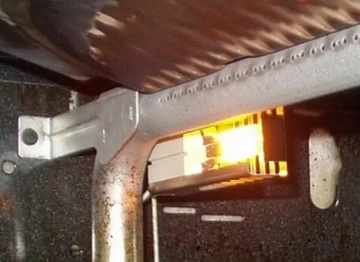
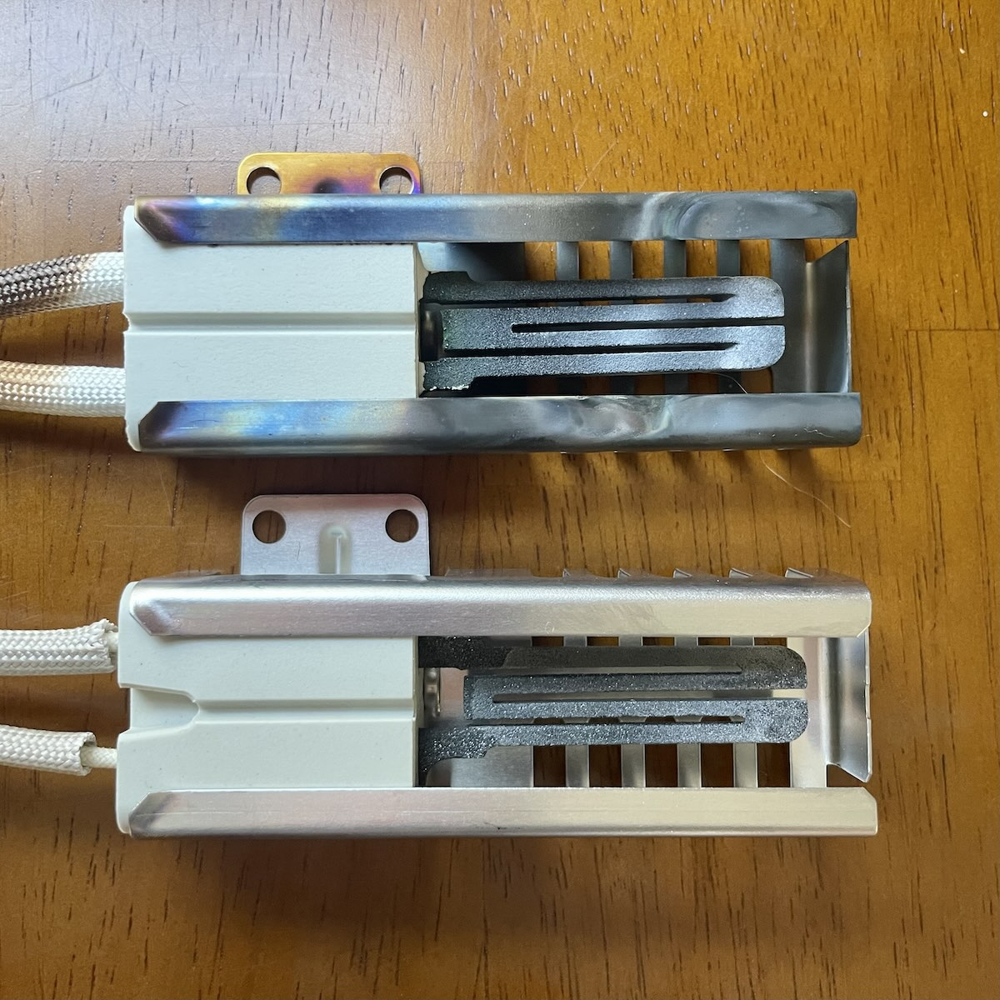
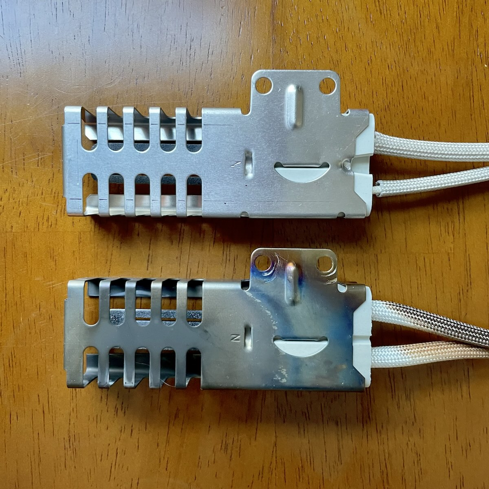
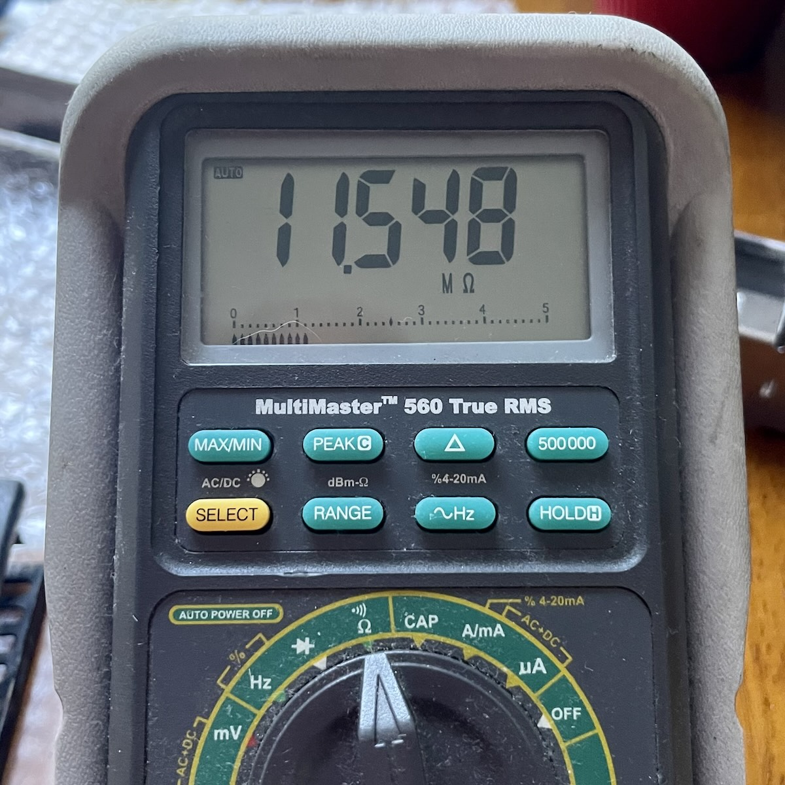
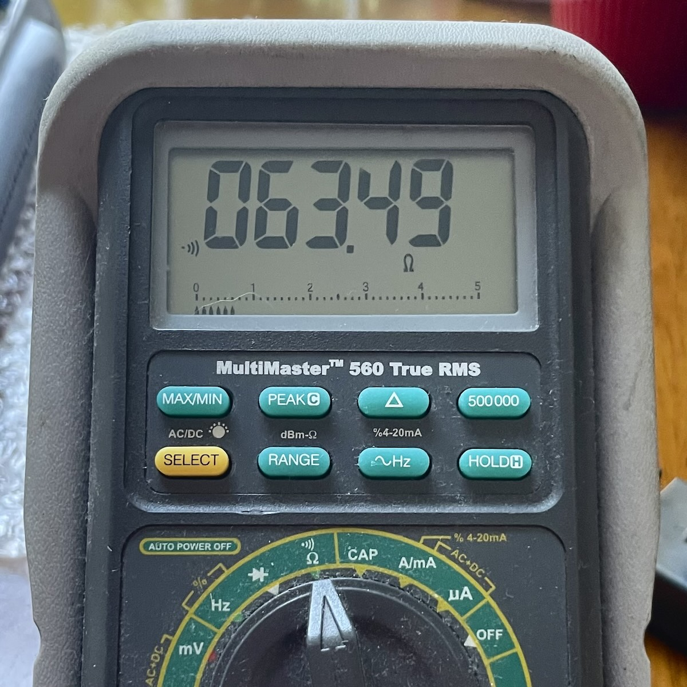
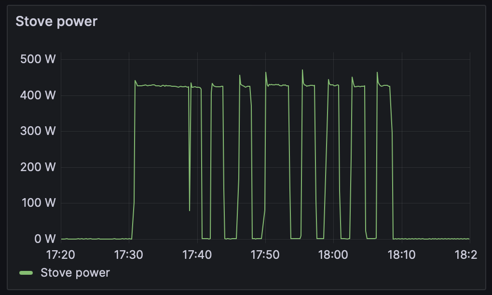

I have a gas oven and recently it stopped heating up. When set to 350 °F, it would sit at *100 °F* for 5, 10, 15 and more minutes. Clearly something was wrong!

In a past life, I analyzed tons and tons of home energy data from [Pecan Street](https://www.pecanstreet.org/dataport/), one of (or maybe the) largest residential energy dataset in the world. From this dataset, I learned that gas appliances often have electrical igniters that consume a substantial amount of power. I guess my oven won't work in a power outage

It looks like the igniter is a resistor that heats up until it's red-hot and then *ignites* the gas piped in. Check out this photo from [howtofixit.net](https://howtofixit.net/why-gas-oven-igniter-glows-but-no-flame/):

There aren't many things better than the satisfaction of fixing something, so I ordered a replacement igniter online. There were only about 6 screws to get to the igniter, so it was a fairly simple (and cheap) project

Here's the old igniter (top) next to the new one (bottom):

Here's the other side of the igniters, they look so happy :D

The old igniter has a really high resistance. It makes sense that the igniter would fail open circuit after all of that heat cycling:

Now let's check out the resistance of the new igniter:

Since this resistor has such an extreme range of operating temperatures, the resistance (and power) is probably significantly different while heating

I have the stove set up on a [Sonoff S31](https://sonoff.tech/product-document/smart-plugs-doc/s31-s31lite-doc/) smart plug with power monitoring. Let's take a look at an hour of oven data while cooking dinner:

Wow, the igniter consumes on the order of 400 W! It looks like there's an initial ~10 minutes of heating following some duty cyling

This makes sense! I don't think the gas flow rate is modulated, so the oven is doing [bang-bang control](https://en.wikipedia.org/wiki/Bang–bang_control) by turning on and off the flame. Wow, that's interesting!

I think the long duty cycle around 17:50 is after the oven door is opened and some food is put inside. This additional thermal load requires more (longer) heating

Anyhow, it was super gratifying to fix my oven, take some pictures of happy resistors, and look at some data. Now it's pizza time :) 