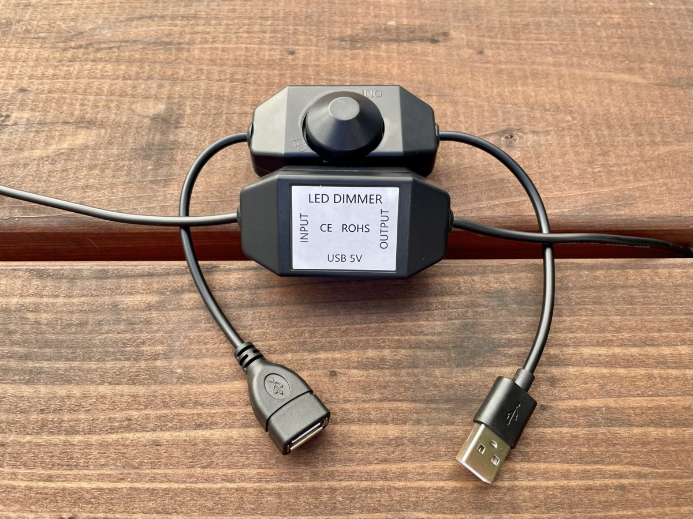
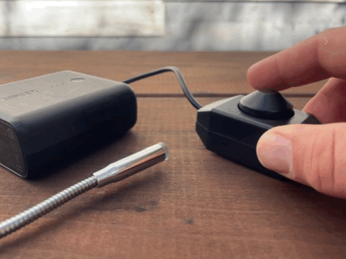

“Take it apart you tease!!” said my friend Clifton after I sent him a video of a USB-A gooseneck LED with the brightness modulated by a USB-A to USB-A dimmer switch to which he was referring

Nothing motivates an engineer more than a personal challenge, and so here I am writing a blog post on my experience

## Background

I am working on a computer vision project that needed some lighting. I opted to use a couple USB-A gooseneck LEDs:

1. Low cost ($5 - 6 on Amazon, search “USB LED flexible light”)
2. Flexible / adjustable so the lights can be aimed and stay put
3. Easy to use
4. In this case, I mean easy to power
    1. What I really mean is powered via USB-A
    2. Power requirements for an LED (or even several) is low enough for USB-A
    3. USB-A is [still] ubiquitous, for example on a [Raspberry Pi](https://en.wikipedia.org/wiki/Raspberry_Pi) (MacBook Pro not withstanding)

I also wanted the ability to dim the LEDs in case the video became overexposed and washed out from too much light. I found something that met the requirements in the “USB LED flexible light” mentioned, but it didn’t have a dimming function

Fear not, you can also find a dimmer switch with a USB-A plug on one end (the input) and a USB-A socket on the other (the output)! In between is a rotating switched potentiometer (rotating it fully in the counter clockwise “off” direction will disengage a switch in the pot). These can also be found on Amazon by searching “LED dimmer USB”

I got the gooseneck LED and USB dimmer switch in, plugged them in to a USB battery, twisted the knob, and the LED got dimmer and brighter — MAGIC!

But to Clifton’s point, what is the magic? I figured it could be:

1. Some kind of [PWM circuit](https://en.wikipedia.org/wiki/Pulse-width_modulation)
2. Maybe a [linear regulator](https://en.wikipedia.org/wiki/Linear_regulator)
3. Or a fancy [DC to DC regulator](https://en.wikipedia.org/wiki/DC-to-DC_converter)

## What’s in the box?!

  