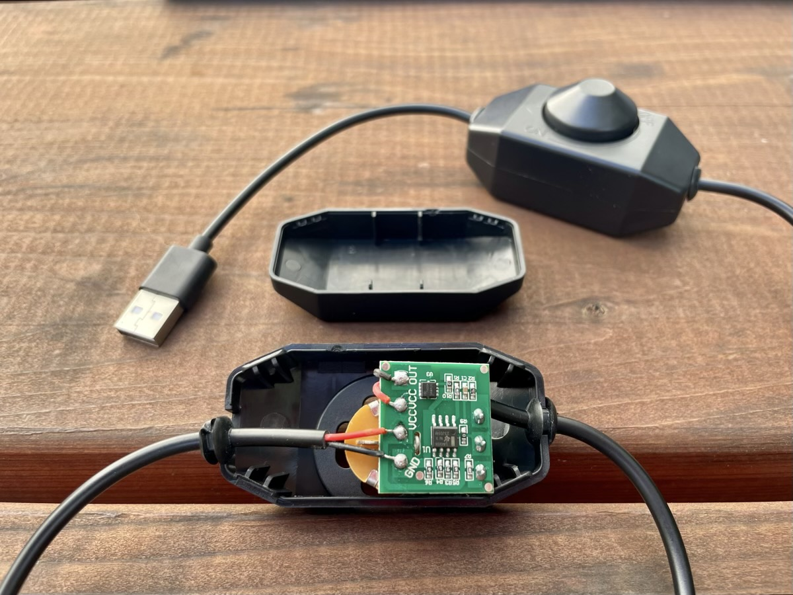
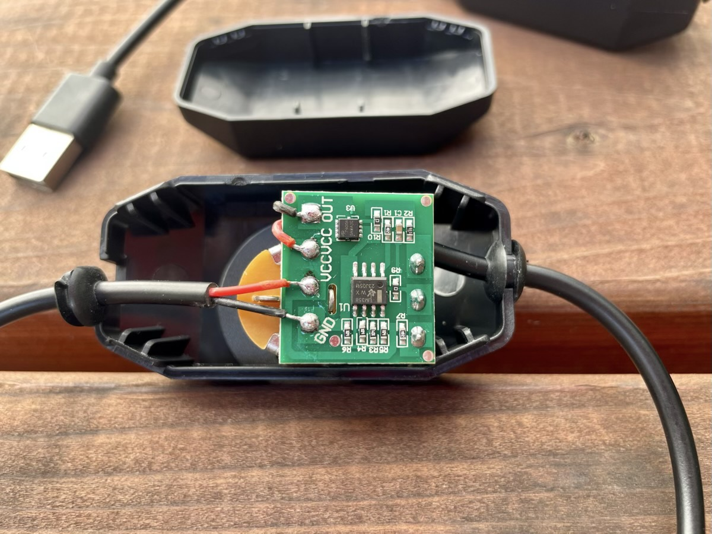
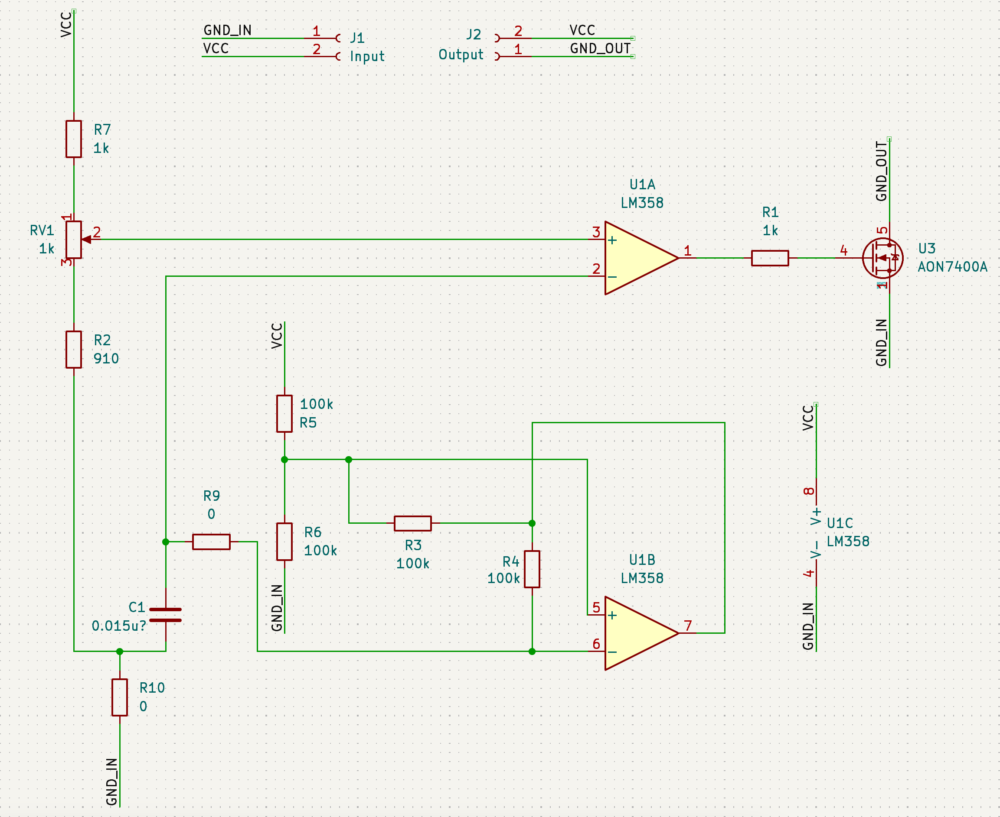
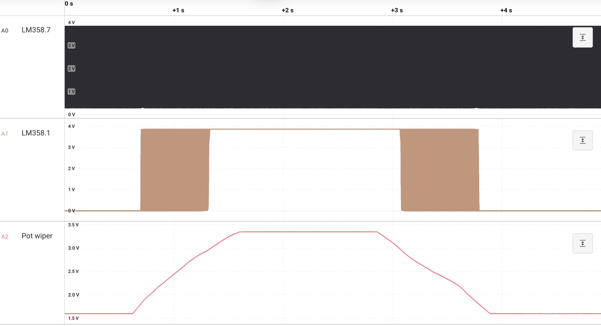
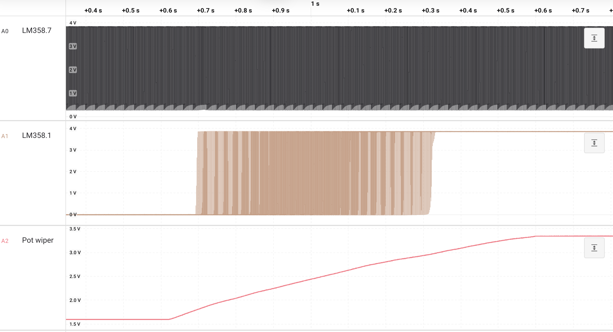
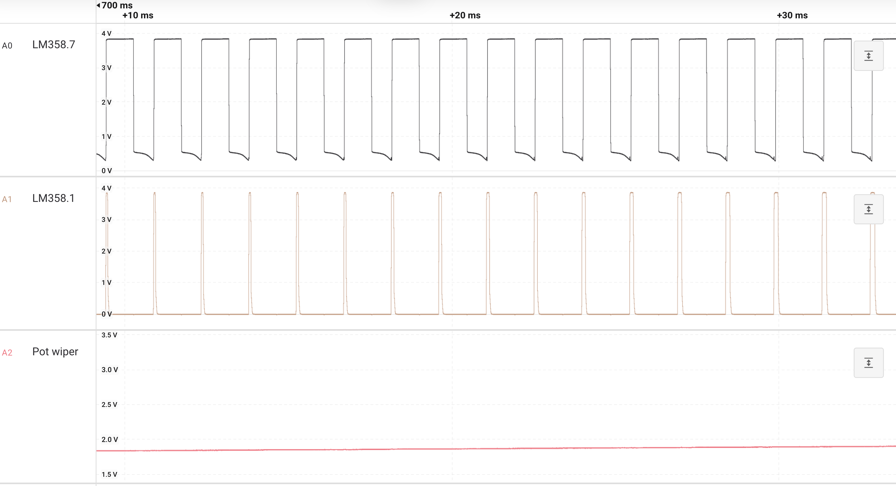
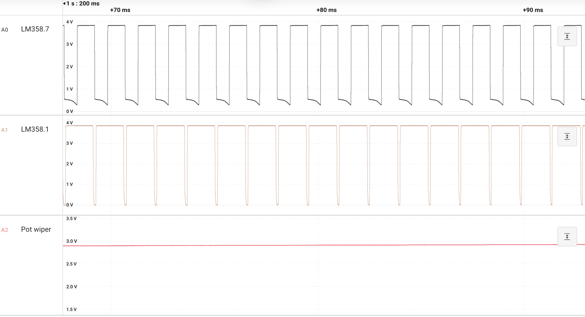
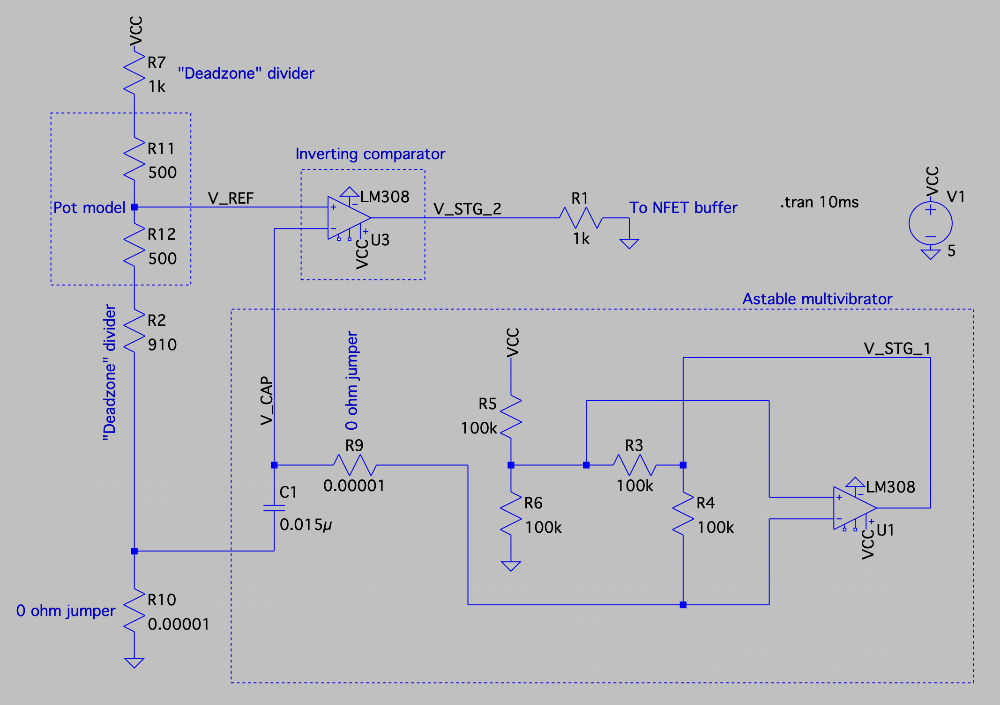
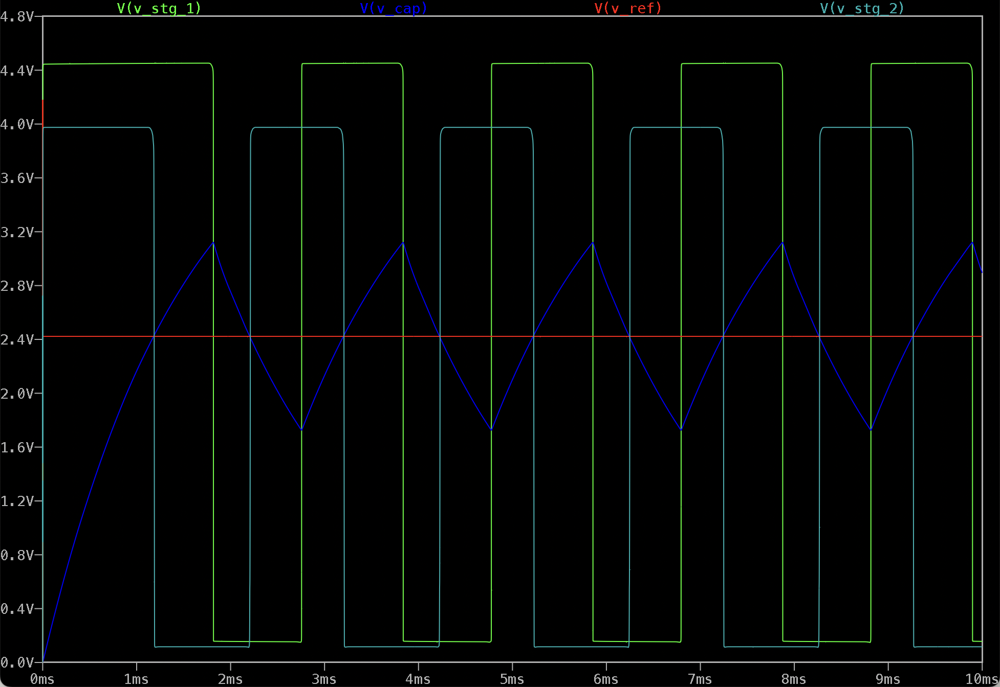

*“Take it apart you tease!!”* said my friend Clifton after I sent him a video of a USB-A gooseneck LED with the brightness modulated by a mysterious dimmer switch

Nothing motivates an engineer more than a personal challenge, so here I am writing a blog post about my experience

## Background

I am working on a computer vision project that needed some lighting. I opted to use a couple USB-A gooseneck LEDs:

1. Low cost ($5 - 6 on Amazon, search “USB LED flexible light”)
2. Flexible / adjustable so the lights can be aimed and stay put
3. Easy to use
    1. In this case, I mean easy to power
       1. What I really mean is powered via USB-A
       2. Power requirements for an LED (or even several) are low enough for USB-A
       3. USB-A is [still] ubiquitous, for example on a [Raspberry Pi](https://en.wikipedia.org/wiki/Raspberry_Pi) (MacBook Pro not withstanding)

I also wanted the ability to dim the LEDs in case the video became overexposed and washed out from too much light. I found something that met the requirements with the “USB LED flexible light”, but it didn’t have a dimming function

Fear not, you can also find a dimmer switch with a USB-A plug on one end (the input) and a USB-A socket on the other (the output)!

Between is a rotating, switched potentiometer (rotating it fully in the counter clockwise OFF direction will disengage a switch in the pot). These can also be found on Amazon by searching “LED dimmer USB”

I order the gooseneck LED and USB dimmer switch, plugged them in to a USB battery, twisted the knob, and the LED got dimmer and brighter — MAGIC!

But to Clifton’s point, what is the magic? I figured it could be:

1. Some kind of [PWM circuit](https://en.wikipedia.org/wiki/Pulse-width_modulation)
2. Maybe a [linear regulator](https://en.wikipedia.org/wiki/Linear_regulator)
3. Or a fancy [DC to DC regulator](https://en.wikipedia.org/wiki/DC-to-DC_converter)

## What’s in the box?!

Let's dig in and see what's inside. First, we'll need to take the knob off which exposes a bit of the potentiometer (I dig the purple!)

The plastic case was pretty easy to open up without breaking the plastic. I didn't break any of the housing, quite an accomplishment :)

Let's zoom in to the PCBA. This is actually the photo I used to reverse engineer the entire circuit, since it's a one-sided board

### The BOM

As you might expect, the PCBA BOM is pretty short:

1. Single-sided PCB
2. 1 kΩ linear response, switched pot
   1. The switch is not actually used, have a look at the floating pin near reference designator U1 (the other pin is off-board)
3. [LM358 opamp](https://www.ti.com/lit/ds/symlink/lm158-n.pdf)
4. [AON7400A N-channel MOSFET](https://www.aosmd.com/res/datasheets/AON7400A.pdf)
5. 4x 100 kΩ resistors (I think all the passives are 0805)
6. 2x 1 kΩ resistors
7. 1x 910 Ω resistor
8. 2x 0 Ω jumper resistors
9. 1x capacitor, maybe around 0.015 µF
   1. I couldn't measure in circuit with a DMM, I used SPICE to educate my guess 

We can already answer some of my early questions:

1. Some kind of PWM circuit? 🟡 Maybe
2. Maybe a linear regulator? 🔴 No!
3. A fancy DC to DC regulator? 🔴 No!

How do we know that?

If you look at the zoomed in picture of the PCBA, you can see the red VCC input and output wires are tied together on the board (and the black GND wires are not)

This dimmer is not regulating +5 V, it's modulating GND between the input and output using a low-side NFET. Interesting!

### The schematic

I used the photo of the PCBA and a DMM in continuity mode to recreate the circuit

It's been a while since I've done a schematic and even longer since I've tried the popular open source tool [KiCAD](https://www.kicad.org), so let's take it for a spin

That's a pretty schematic! The LM358 is part of the default library which is nice. The AON7400A is not, but a pin-compatible NFET is, so that's nice too!

It's now apparent that one opamp is configured as an [inverting comparator](https://en.wikipedia.org/wiki/Comparator) (U1A). My guess is that the other opamp (U1B) is an oscillator of some sort

In many applications, an opamp (or logic gate) based oscillator would be undesirable. The frequency of oscillation wouldn't be the same across units, or even on the same unit across temperature and voltage, limiting its usefulness

However, the absolute frequency of the oscillator probably doesn't matter across units or temperature when dimming LEDs

### Scope it out

I used a [Saleae Logic Pro 8](https://www.saleae.com) USB data acquisition box sampling at 12.5 Msps (excessively fast!) to take a look at:

1. The output of U1B, the astable multivibrator
2. The output of U1A, the inverting comparator
3. The wiper of the potentiometer

I started with the knob in the OFF position and fully rotated it to the ON position, then rotated it back to OFF

Here's the full sweep:

The ramp up:

Zoomed in early to see low duty cycle:

Zoomed in to see high duty cycle:

Things of note:

1. We can see the effects of the "deadzone" resistors in the pot wiper traces
   1. I'll explain these in the SPICE section 
   2. The wiper goes from 1.6 V to 3.4 V, without it would have gone 0 to 5 V
2. The oscillator has a cycle time around 1.4 ms (call it 700 cycles per second)
3. We see lower comparator duty cycles at low wiper voltage values (knob is low)
4. We see higher comparator duty cycles at high wiper voltage values (knob is high)
5. We see clearly defined OFF at low wiper values and ON at high wiper values (no glitches)

### SPICE up your life

It's been a while since I did a schematic but it's been even longer since I did [SPICE](https://en.wikipedia.org/wiki/SPICE) simulations

**Note:** I've definitely spent more time than expected on this project, but at this point I'm in too deep to quit!

I downloaded and installed [LTspice](https://www.analog.com/en/resources/design-tools-and-calculators/ltspice-simulator.html) from Analog Devices and re-drew the important parts of the circuit

I've labeled some parts of the schematic:

1. **Pot model:** the two series 500 Ω resistors are standing in for the potentiometer set to 50%
2. **"Deadzone" divider:** these two resistors add some "deadzone" or "deadband" at either extreme of the pot. They are intended to have a bit of margin in the *all the way on* and *all the way off* regions of the potentiometer. I think they are a nice touch!
3. **Inverting comparator:** This compares the reference voltage set by the potentiometer (aka resistor divide) to an oscillator voltage
4. **Astable multivibrator:** An [astable multivibrator](https://en.wikipedia.org/wiki/Multivibrator#Monostable_using_op-amp) is a type of oscillator. This one is biased up by half of the rail voltage since it's a single voltage supply circuit
5. **0 ohm jumper:** I set these resistances to an impossibly small value (they can probably be set to 1 milli-Ω). SPICE doesn't like solving circuits with 0 Ω resistors

#### SPICE results

1. **V(v_stg_1) green:** the voltage at the output of U1B, the astable multivibrator
   1. The engine of the circuit, generating a triangle wave to "chop up" into a PWM output  
2. **V(v_cap) blue:** the voltage at C1 which is the sort of triangle wave core of the multivibrator
   1. The triangle wave generated by [slew](https://en.wikipedia.org/wiki/Slew_rate) on C1 
3. **V(v_ref) red:** the DC voltage coming out of the potentiometer / resistor divide circuit. This will be the reference voltage for the comparator
    1. The user sets the brightness AKA GND duty cycle with this knob / voltage
4. **V(v_stg_2) light blue:** the voltage at the output of U1A which drives the non-inverting NFET buffer
    1. This is the actual signal that is "chopping" GND between the input and output

## Bringing it all together

Alright, that's a lot for a little $5 dimmer box!

1. We saw the dimmer box with a knob, USB-A in (plug), and USB-A out (socket)
2. We saw a gif of the knob being turned and LED brightness being modulated
3. We pulled the knob off and took a look at the circuit
4. We looked at the BOM for the PCBA
5. We drew the schematic in KiCAD
6. We looked at the output of each opamp and the potentiometer wiper on a Saleae scope
7. We re-drew 😑 the schematic in LTspice
8. We simulated the circuit and looked at the voltage at 4 nodes

And the winner of *What's in the box?* is ...

Some kind of PWM circuit 🟢

An astable multivibrator driving an inverting comparator driving an NFET modulating GND between the input and output. Hey, it works!

## Unintended self-dimming

These dimmers were intended for use with the gooseneck LED shown in the gif. I had two of them running on 5 V without a dimmer for several days

Unfortunately, the LEDs are now noticeably less bright. On the left is a brand new gooseneck LED, on the right is an old one:

Oops, back to the drawing board!

Anyway, thanks for the peer pressure, Clifton! :)
