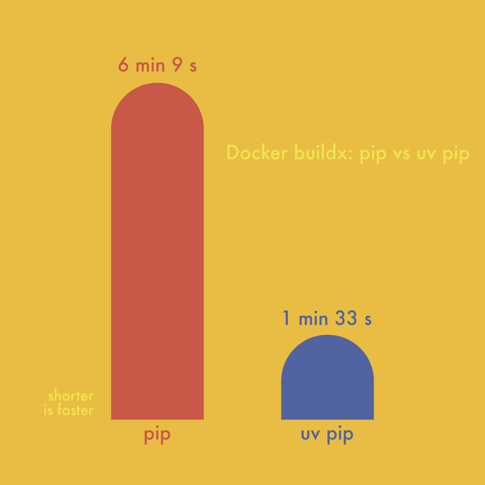

If you use Python and you haven't heard of [Astral uv](https://docs.astral.sh/uv/) it might be time to take a look. `uv` claims to be:

> A single tool to replace pip, pip-tools, pipx, poetry, pyenv, twine, virtualenv, and more.

Great! I use pip, pyenv, and virtualenv. It also claims to be:

> 10-100x faster than pip.

Wow. Big if true.

Let's do our own real-world benchmark

# Testing uv

Change is hard and changing software tooling is no exception

There can be a real productivity hit that needs to be balanced when learning new tools and technology. In addition, it's not every day that we need to install a new version of Python with `pyenv` or set up a `virtualenv` for a new project

Now that I think about it, I don't tend to think of `pip install` as a bottleneck in my workflow. Would a 10 - 100x speed up even matter to me?

## The test

I took a Docker image that runs [Streamlit](https://streamlit.io) and all of the related data analysis packages you can think of for my test. This particular image is built with `docker buildx` for multi-platform support: building an `linux/arm64` image on `linux/amd64`

A single build of the image took around 6 minutes and 9 seconds without any layers or caching or other clever solutions

When changing the base image from:

```docker
python:3.11-slim
```

to:

```docker
ghcr.io/astral-sh/uv:python3.11-bookworm-slim
```

and changing the `pip install` command from: 

```bash 
pip install -r requirements.txt
```

to:
```bash
uv pip install -r requirements.txt --system
```

the same build took just 1 minute and 33 seconds, a 75% reduction! That's a win-win-win: reduced development and deployment time, reduced cloud bills, and reduced environmental impact

Let's visualize this comparison:



# Conclusion

While we didn't find that `uv pip` was 10 - 100x faster than `pip`, we did see a 75% reduction in Docker image build time from a 2 line code change -- essentially for free

Thanks [Astral team](https://astral.sh)! I look forward to playing with `uv` more :)

